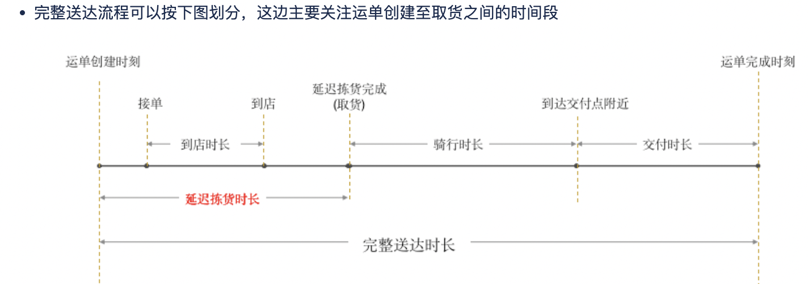

# 重点

困难点，解决方法，用到的技术/贡献

## 1、ETA

- **运单创建到取货时长 = max(运单创建时刻 + 预估的延迟拣货时长，骑士到店时刻 + 120)**
- Ps：骑士到店时刻通过地图路径可以直接计算, 所以延迟拣货时长不需要骑士特征

**特征：**城市, 门店组,是否周末, 订单创建hour, 历史同hour时间(近7天、近一个月同星期)等

**挑战：**

针对“骑士到店后立马能够取货”的订单，是否需要在进行统计预估的时候考虑这部分数据？并且如何考虑？

**解决方法：自定义损失**

## 2、压力值

**单量预估：**

**特征**：利用历史单量(近7天、近一个月同星期)、运力(可用骑士背单数量)、天气、是否周末/节假日以及门店组+周几+第几月

需要one-hot处理，使用catboost，擅长处理离散特征

**模型：**catboost(lr)

**峰期预估：**全天每半小时预估单量+KMeans聚类

## 3、智能hold单(送达时间预估)

**目标：**提人效(驻店)+保履约(驻店履约更有保障)

**模型：**catboost，

**特征**：压力值、hold时间，超时预估时间、众包运力情况、众包接单时间

峰期：全天每半小时预估单量+KMeans聚类

## 4、路区

路区功能优化。以路区和AOI(楼宇/小区)为单元进行订单聚集，并解决天然屏障跨越等不合理问题；

动态跨路区系统构建。在智能hold单时间后允许跨路区，实现聚单功能。跨路区时综合考虑路区、距离和压力值等因素。

## 5、楼栋坐标校正

痛点：定位不准，骑士体验差

达达骑士由于通常需要送货上楼，因而**面临小区内寻址困难这个问题**：即由于地图定位等的缺失，无法精确定位具体楼栋位置，导致骑士不得不通过经验、频繁问路、或者来回寻找的方式找到目标楼栋，效率较低。 此项目的目的就是希望**借助历史数据与算法能力，精确定位楼栋，提高骑士小区内寻址效率**。

模型：dbscan 聚类

1. 整个流程：
   1. 离线收集历史送达数据
   2. 离线做数据清洗、划分区域、提取楼号
   3. 离线分区域分楼栋密度聚类
   4. 离线准备地址库用于线上查询
   5. 线上根据输入地址匹配地址库进行查询，若能匹配上某个地址，则返回纠偏后的结果

**具体方法：**

完单数据--数据清洗--划分网格--坐标聚类--生成地址库

**挑战：**

大量数据噪音(骑士轨迹漂移、骑士作弊行为)，参数难以设置(不同区域的楼栋订单密度具有很大差异，不同参数导致楼栋坐标定位不准)

**解决方案：**

识别骑士漂移：识别骑士上传坐标点(30s)，计算每个骑士点之间是否有异常距离(步行速度1.5米/s)

## 6、体感顺路

模型：主要是规则

特征：以骑士位置和订单距离等为主要特征，计算角度(全路径最大夹角、起点视角最大夹角、分歧点视角最大夹角、全路径加权平均夹角)

挑战：

从无到有重新建立一套规则，无法从数学或线下验证其合理性

过程：看case+算角度+修正

## 7、全局匹配

模型：二分图+KM算法、ortools、遗传算法

特征：订单履约时效、背单上限等作为模型约束条件，以单均距离为优化目标

挑战：加上时效和背单约束，定义清楚目标(单均距离最短、时薪最大等)

## 8、仿真系统

仿真系统的构建和优化。作为一个通用的线上模拟系统，仿真系统以线上骑士和订单历史数据为输入，结合线上不同订单分发模式(驻店/众包派单等)，在线下模拟实际效果，加快策略优化和评估过程

挑战(问题)：

仿真系统版本和线上版本割裂，导致仿真系统迭代滞后

解决：

考虑到实际情况和短期价值等情况，搁置

负责过的两个主要的项目，是路区项目和前置仓项目，主要是根据业务需求的实现相关功能，并配合测试和推广。在此过程中，会有一些比较重要的、跟算法相关的工作。

比如路区业务说正常情况下，骑士不需要跨路区送单。但是在压力没那么大、单量不足的情况下，可以跨路区派单，增加骑士带单量。那么如何衡量压力大不大呢？我们根据门店当前单量、可用运力情况等信息构建压力值，作为一个基础能力来评估当前门店压力情况。

诸如此类，还有ETA和楼栋地址纠偏等等，最近的工作是基于驻店系统订单分发系统的改造，将人单匹配优化为全局匹配，并持续迭代匹配算法。