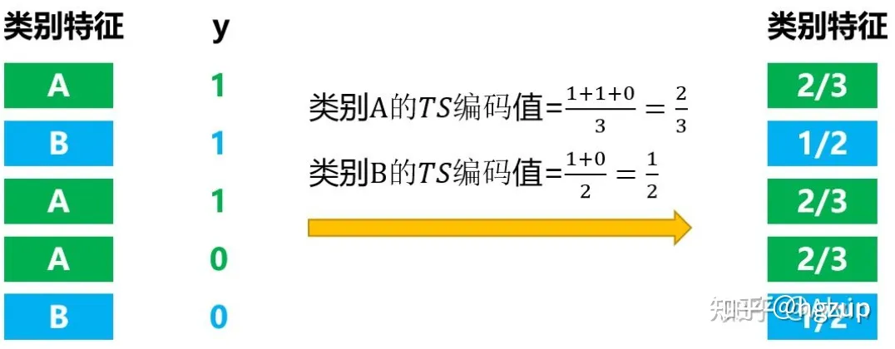

# CatBoost算法解读

https://zhuanlan.zhihu.com/p/477750675

## 1.基本介绍

CatBoost算法是gradient boosting算法中的一种，是继XGBoost、LightGBM之后第三个基于GBDT改进的算法。

三个的优点： 

- 它自动采用特殊的方式处理**类别型特征（categorical features）**。首先对categorical features做一些统计，计算某个类别特征（category）出现的频率，之后加上超参数，生成新的数值型特征（numerical features）。这也是我在这里介绍这个算法最大的motivtion，有了catboost，再也**不用手动处理类别型特征了。** 

- catboost还使用了**组合类别特征**，可以利用到特征之间的联系，这极大的**丰富了特征维度**。

- catboost的基模型采用的是**对称树**，同时计算leaf-value方式和传统的boosting算法也不一样，传统的boosting算法计算的是平均数，而catboost在这方面做了优化采用了其他的算法，这些改进都能**防止模型过拟合**。

相较于GBDT、XGBoost、LightGBM算法，CatBoost算法有很多特点，但最引人注目的还是这两个：

- 对分类型特征的处理。这使得我们在训练模型之前可以考虑不用再通过特征工程去处理分类型特征
- 预测偏移处理。这可以减少模型的过拟合，提升模型预测效果

## 3.分类型特征处理

一般算法通常只接受数值型数据输入，因此在训练模型前需要对分类型特征进行特征工程处理。在特征工程中，不可避免的会受我们的主观经验影响，选用什么样的方法处理呢？是选用分箱处理、one-hot编码、TS(target statistics)编码、label编码还是其它方式中的一种呢？具体怎么实施呢？这可能需要反复调试，看那种效果好。CatBoost算法包含了对分类型特征的处理方式，主要包括：空值处理、ordered TS编码、特征组合。

这里要说明的是，不能说CarBoost算法的处理方式一定效果最好，在一些业务场景下主观经验也会非常有帮助，因此是否使用CatBoost算法来处理分类型特征取决于具体的业务场景。

### 3.1 空值处理

在CatBoost包的说明文档中，类别型特征的空值处理做了这样的说明：CatBoost does not process categorical features in any specific way，意思就是不做特别处理，但具体怎么做的我不确定(没看过源码)，我个人的理解是将每一个空值都当作一个区别于其它取值的唯一值，不仅是区别于那些非空值，空值之间也相互区别。

### 3.2 ordered TS编码

这是基于TS编码改进的一种编码方式。对于一些类别基数比较小的特征，例如2~3类，可以直接使用one-hot编码，但对于类别基数较大的特征，one-hot编码会产生特征维度问题，这种情况下TS编码会合适一些。

**3.2.1 TS 编码**

TS编码是一种有监督编码，其做法是：将类别取值转换为该类别为正类的概率。用公式来说明

其中 nx=xi,y=1 表示特征 x 取值为 xi 、样本类别为1(即正类)的样本数量， nx=xi 表示特征 x取值为 xi 的样本数量。举例说明（该图片取自[艾宏峰：【务实基础】CatBoost](https://zhuanlan.zhihu.com/p/346420728)）

TS编码有一个缺点，极端情况下当训练集中某类取值只有一个样本、或者没有样本时，计算的编码值就失真了，也就是容易受噪声数据影响。

**3.2.2 Greedy TS编码**

针对TS编码存在的问题，可以用Greedy TS编码来处理。在Greedy TS编码中，增加了先验概率p来减轻噪声数据的影响。Greedy TS编码的计算公式如下

其中 a 是一个大于0的参数，用来控制先验概率的影响程度；p是先验概率，即样本为正类的概率，计算方式是正类样本数除以样本总数。

Greedy TS编码也存在一个问题，即目标泄露，怎么理解？以上计算Greedy TS编码时用到了nx=xi,y=1、nx=xi、p这几个统计量，当测试集和训练集中样本分布不一致时，这两个统计量的值就会不同，因此在训练集上计算Greedy TS编码会存在过拟合情况，也就是所谓的目标泄露。

**3.2.3 ordered TS编码**

CatBoost算法中采用了ordered TS编码方法来解决Greedy TS编码的目标泄露问题。ordered TS编码是基于排序的，在CatBoost算法中，会对样本进行多次洗牌，每次得到不同排序状态的样本集。为什么要排序？排序的目的产生一种随机性，减少过拟合。每一轮迭代、构建一个树时，都会选择一种排序状态的样本集，这样在不同轮次迭代中，不同排序状态的样本集综合起来，会使模型的方差更小，越不容易过拟合。

在某种排序状态 σ 下，样本 xi 在分类特征 k 下的值为 xik ，xik的ordered TS编码值是基于**排在其前面**的样本Dσ计算的，在Dσ中计算分类特征 k 下取值与xik相同的样本的Greedy TS编码值，该值即为的ordered TS编码值。举例说明

在上图中，经过样本排序后，样本的排序情况为{4,3,7,2,6,1,5}，计算样本4的ordered TS编码值时，由于没有样本排在其前面，因此其ordered TS编码值计算方式为

计算样本6的ordered TS编码值时，排在其前面的样本为{4,3,7,2}，在这4个样本中，特征取值为D的只有样本4，因此其ordered TS编码值计算方式为特征。

### 3.3 特征组合

特征组合是指将样本集中的类别型特征进行组合，组合后的特征作为样本集上新的类别型特征。这样做有什么好处？这其实也是特征工程中的一种方式，它丰富了特征的维度，在节点划分时多了一个候选特征，但不一定就是有用的，具体还是要结合实际的业务场景和数据来看。当样本集中类别型特征比较多时，特征组合会产生大批新特征，这在实际训练模型中是不可行的，那CatBoost算法中特征组合是怎么执行的？举例来说明

（CatBoost算法用的基模型是对称树，其特点是每一层使用同样的特征来分裂，这个后面再细说）

在上图中，第一层分裂不做特征组合操作，此时选用了特征a作为分裂特征；进入第二层分裂，此时建树过程已使用的分裂特征集合为 { 特征a }，将所有类别型特征与已使用的分裂特征集合中的特征进行两两组合，也就是与特征a进行两两组合，得到一批新的类别型特征，参与结点分裂（注意相同的特征不再参与两两组合，例如特征a不能再与特征a进行组合），最终选用了特征b作为分裂特征；进入第三层分裂，此时建树过程已使用的分裂特征集合为 { 特征a，特征b }，同样的，将所有类别型特征与已使用的分裂特征集合中的特征进行两两组合，也就是与特征a、特征b进行两两组合，得到一批新的类别型特征，参与结点分裂，最终选用了特征c作为分裂特征。以上就是CatBoost算法中特征组合具体执行的过程，一句话总结就是：将所有的类别型特征与之前建树过程中已使用的特征进行两两组合。

还是有几点需要再说明一下：（1）如何某层分裂中用到了组合特征，那么这个组合特征还是可以与其它特征进行组合，参与到下次的分裂过程；（2） CatBoost算法还可以将数值型特征与类别型特征进行组合，操作方式是依据数值型特征的分裂阈值，将其处理为两个类别型特征，然后参与特征组合。例如某层分裂用到了数值型特征p，分裂阈值为 p>10 ，那么就可以将特征p处理为“p>10”、“ p<=10 ”两个类别型特征。