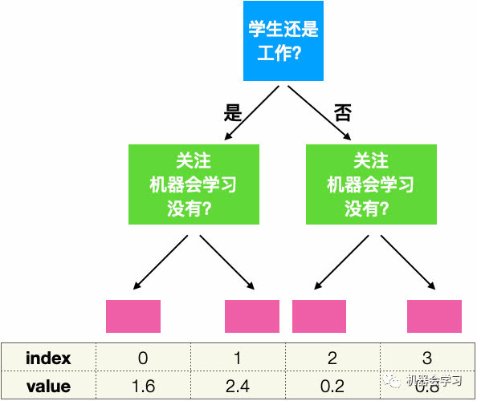

# 对称树

对称树中，每一层的每一个节点判断条件都是一样的。假如如果我们只训练一棵树，那么显然对称树的overfit能力会比普通的决策树弱；但是在GBM中，我们通常训练很多的树，所以overfit的能力不必担心。那么对称树在GBM中有什么优势呢？下面列出三点：

- 拟合模式相对简单，因为每一层都是一个判断条件

- 可以提高预测速度

- 对称树的结构本身比普通决策树自由度小，可以看作是加入了penalty，或者看作regularization

我认为最大的优势就是第二点——预测速度会提升。为什么会更快呢？

上面这棵树最底层有四个节点，我们可以把这四个节点从0到3编号（index），每一个节点有一个对应值（value）。比如一个样本最终进入了第一个节点，那么这棵树对这个样本的预测值就是1.6。我们可以把value存放在一个数组里面，这样给定index就可以立刻得到value。那么对一个样本用一棵树进行预测时，我们只需要找到这个样本对应的index，因为在对称树中每一层的判断条件都是一样的，所以每一层都可以用0或者1来表示，比如是学生，用1表示，不是用0；有关注机器会学习用1表示，没有用0，那么每一个样本进入这棵树，都可以用两个bits来表示，也就是四种可能结果：00，01，10，和11。这两个bits代表的数字就是index。这意味着什么呢？我们在做预测的时候，只要对每一层的条件进行判断，然后就可以找到index。因为每一个树的结构（判断条件）是已知的，我们甚至可以对这个过程进行[并行计算](https://cloud.tencent.com/product/gpu?from=20067&from_column=20067)。

目前对称树在catboost中已经实现，xgboost和lightgbm都依然使用传统的决策树结构。传统的决策树对每一个样本进行预测时都要从根节点遍历这棵树，但是应用catboost中的对称树我们只要进行数组的操作。下面的模型预测速度对比结果来自catboost的官方网站[3]（40万样本，2000个特征），可见对称树在预测速度上的优异表现。