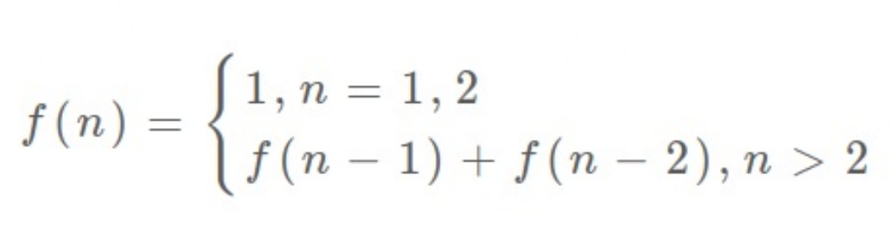

http://t.zoukankan.com/aabbcc-p-6504597.html#q10

**斐波那契数列：**

动态规划三要素：重叠⼦问题、最优⼦结构、状态转移⽅程

递归：⾃顶向下

动态规划：⾃底向上

动态规划⼀般都脱离了递归，由循环迭代完成计算。

状态转移⽅程这个名词，实际上就是描述问题结构的数学形式：



把 f(n) 想做⼀个状态 n，这个状态 n 是由状态 n - 1 和状态 n - 2 相加转移⽽来，这就叫状态转移，仅此⽽已。

**动态规划问题最困难的就是写出状态转移⽅程**


**凑零钱问题：**

因为它具有「最优⼦结构」的。**要符合** **「最优⼦结构」，⼦问题间必须互相独⽴**

回到凑零钱问题，为什么说它符合最优⼦结构呢？⽐如你想求 amount = 11 时的最少硬币数（原问题），如果你知道凑出 amount = 10 的最少硬币数（⼦问题），你只需要把⼦问题的答案加⼀（再选⼀枚⾯值为 1 的硬币）就是原问题的答案，因为硬币的数量是没有限制的，⼦问题之间没有相互制，是互相独⽴的。


具体来说，动态规划的⼀般流程就是三步：**暴⼒的递归解法** **->** **带备忘录的递归解法** **->** **迭代的动态规划解法**。 

就思考流程来说，就分为⼀下⼏步：**找到状态和选择** **->** **明确** **dp** **数组/函数的定义** **->** **寻找状态之间的关系**。 

**明确 base case -> 明确「状态」-> 明确「选择」 -> 定义 dp 数组/函数的含义。** 

按上⾯的套路⾛，最后的解法代码就会是如下的框架：

```python
# ⾃顶向下递归的动态规划
def dp(状态1, 状态2, ...):
  for 选择 in 所有可能的选择:
    # 此时的状态已经因为做了选择⽽改变
    result = 求最值(result, dp(状态1, 状态2, ...))
  return result

# ⾃底向上迭代的动态规划
# 初始化 base case
dp[0][0][...] = base case
# 进⾏状态转移
for 状态1 in 状态1的所有取值:
  for 状态2 in 状态2的所有取值:
    for ...
    	dp[状态1][状态2][...] = 求最值(选择1，选择2...)
```

思考如何列出正确的状态转移⽅程？ 

1、**确定 base case**，这个很简单，显然⽬标⾦额 amount 为 0 时算法返回 0，因为不需要任何硬币就已经凑出⽬标⾦额了。 

2、**确定「状态」，也就是原问题和⼦问题中会变化的变量**。由于硬币数量⽆限，硬币的⾯额也是题⽬给定的，只有⽬标⾦额会不断地向 base case 靠近，所以唯⼀的「状态」就是⽬标⾦额 amount。 

3、**确定「选择」，也就是导致「状态」产⽣变化的⾏为**。⽬标⾦额为什么变化呢，因为你在选择硬币，你每选择⼀枚硬币，就相当于减少了⽬标⾦额。所以说所有硬币的⾯值，就是你的「选择」。 

4、**明确 dp 函数/数组的定义**。我们这⾥讲的是⾃顶向下的解法，所以会有⼀个递归的 dp 函数，⼀般来说函数的参数就是状态转移中会变化的量，也就是上⾯说到的「状态」；函数的返回值就是题⽬要求我们计算的量。就本题来说，状态只有⼀个，即「⽬标⾦额」，题⽬要求我们计算凑出⽬标⾦额所需的最少硬币数量。 

**所以我们可以这样定义 dp 函数：dp(n) 表示，输⼊⼀个⽬标⾦额 n，返回凑出⽬标⾦额 n 所需的最少硬币数量。** 
