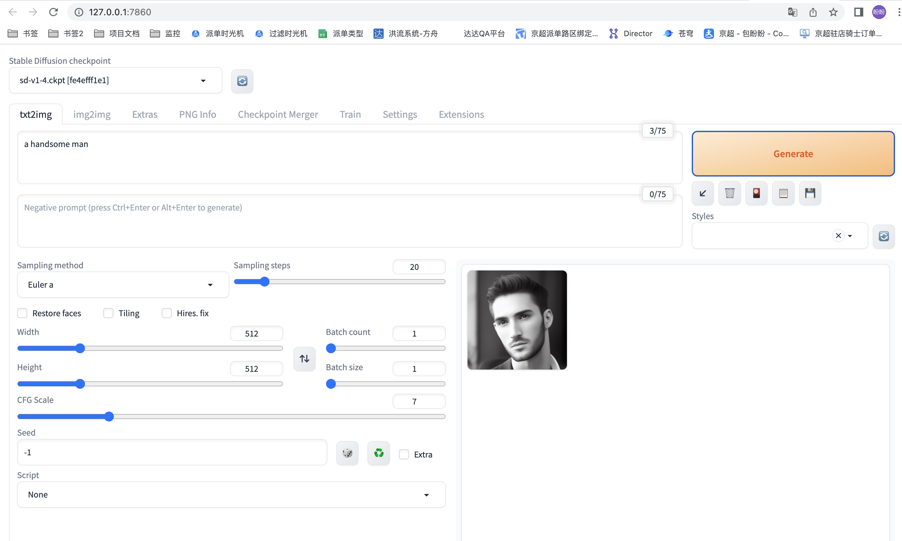

GitHub地址：https://github.com/AUTOMATIC1111/stable-diffusion-webui

喂饭级stable_diffusion_webUI使用教程(本地)：https://zhuanlan.zhihu.com/p/617997179

最近很火的AI绘画NovelAI，WebUI搭建（windows+nvidia）：https://zhuanlan.zhihu.com/p/573395945

stable diffusion 基础教程之Mac安装stable diffusion-webui：https://zhuanlan.zhihu.com/p/622139724#:~:text=同样先打开terminal，在terminal里进入stable-diffusion-webui文件夹，具体命令操作如下：%20cd%20%2FUsers%2Fxxxx%2Fstable-diffusion-webui%2F%20然后运行：.%2Fwebui.sh,（在terminal里，%25后边就是我们要运行的代码）%20当运行看见下图所示即安装成功，把%20127.0.0.1%3A7860%20粘贴到浏览器打开，即可开启我们的AI绘画之旅

D1 - 安装Stable Diffusion For Mac M1 Pro： https://zhuanlan.zhihu.com/p/624586478

AI绘画文章合集0310： https://mp.weixin.qq.com/s?__biz=MzI2NTQ0MjY5Nw==&mid=2247484934&idx=1&sn=7c0bc2f88f784af717d04c6d24f12846&chksm=ea9c02e0ddeb8bf622b15ea48528f45d6eece848dce6704cb535b39e02d88f59a4472179fc03&token=1837502458&lang=en_US#rd

## mac

0、前置：镜像源更换为：http://pypi.douban.com/simple 

1、进入执行(/Users/baopanpan/workspace/StableDiffusion/conda) baopanpan@ZBMAC-26183b23e stable-diffusion-webui % ./webui.sh

2、问题 ERROR: Cannot activate python venv, aborting..., even when python3-venv is installed #1120 

https://github.com/AUTOMATIC1111/stable-diffusion-webui/issues/1120

最终解决： rm -rf venv/`, and run `python3 -m venv venv/

3、未使用GPU加速时，出图报错

> RuntimeError: "LayerNormKernelImpl" not implemented for 'Half’
>
> 

基础绘图模型：https://huggingface.co/stabilityai/stable-diffusion-2/tree/main

第一次：

Windows：

从零开始，手把手教你本地部署Stable Diffusion Webui AI绘画(Win系最新版)：https://zhuanlan.zhihu.com/p/613530403
