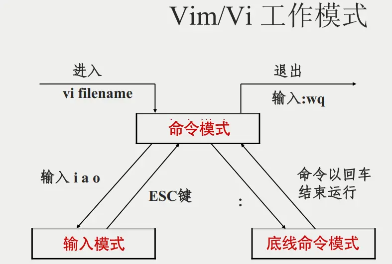

# 基础命令

## 1、命令和命令行

命令行：即Linux终端(terminal)，是一种命令提示符页面。以纯“字符”的形式操作系统，可以使用各种字符话命令对系统发出操作指令；

命令：即Linux程序。一个命令就是一个Linux的程序。命令没有图形化页面，可以在命令行(终端中提供字符化的反馈；

## 2、Linux命令基础格式

无论是什么命令，用于什么用途，在Linux中，命令有其通用的格式：

command [-options] [parameter]

- command：命令本身；
- -options：[可选，非必填]命令的一些选项，可以通过选项控制命令的行为细节；
- parameter：[可选，非必填]命令的参数，多数用于命令的指向目标等；

## 3、Linux基础命令

https://zhuanlan.zhihu.com/p/420247468

绝对路径：以**根目录为起点**，描述路径的一种写法，路径描述以/开头；

相对路径：以**当前目录为起点**，描述路径的一种写法，路径描述无需以/开头；

特殊路径符：

- . 表示当前目录
- .. 表示上一级目录
- ～ 表示home目录

| 命令                                                         | 选项                                                         | 功能/备注                                            |
| ------------------------------------------------------------ | ------------------------------------------------------------ | ---------------------------------------------------- |
| ls [-a -l -h] [linux路径]                                    | -h表示以易于阅读的形式，列出文件大小，如K、M、G； -h选项必须要搭配-l一起使用 | 参数写法： ls -l -a = ls -ls = ls -al           |
| cd [Linux路径]                                               | 无选项； 不写参数表示回到用户home目录；                 | 更改当前所在工作目录                                 |
| pwd  (print work directory)                             | 无选项；无参数                                               | 查看当前所在的工作目录                               |
| mkdir [-p] Linux路径  (make directory)                  | -p：自动创建不存在的父目录                                   | 创建新的文件夹                                       |
| touch Linux路径 **可用vim替代**                         |                                                              | 创建文件                                             |
| cat Linux路径                                                |                                                              | 查看文件内容                                         |
| more Linux路径                                               |                                                              | 分页查看文件内容 (空格翻页，q退出)              |
| cp [-r] 参数1 参数2 (copy)                              | -r可选，用于文件夹的复制，表示递归； 参数1:Linux路径，表示被复制的文件或文件夹； 参数2:Linux路径，表示要复制去的地方； | 复制文件或者文件夹                                   |
| mv 参数1 参数2                                               |                                                              | 移动文件或者文件夹                                   |
| rm [-r -f] 参数1 参数2 ...参数n                              | -f表示force，强制删除； -r用于删除文件夹                | 删除文件或者文件夹                                   |
| which 要查找的命令                                           |                                                              | 查看所使用的命令的程序文件存放在哪里                 |
| find 起始路径 -name “被查找文件名”  find 起始路径 -size +/-n[KMG] | +、-表示大于和小于 n表示大小数字 KMG表示大小单位   | 搜索指定文件                                         |
| grep [-n] 关键字 文件路径                                    | -n，可选，表示在结果中显示匹配的行的行号 参数，关键字，必填，表示过滤的关键字，带有空格或其它特殊符号 参数，文件路径，必填，表示要过滤内容的文件路径，***可作为内容输入端口*** | 查找文件制定行                                       |
| wc [-c -m -l -w] 文件路径                                    | -c：统计bytes数量； -m：统计字符数量； -l：统计行数； -w：统计单词数量； 参数，文件路径，被统计的文件，***可作为内容输入端口*** | 统计文件的行数、单词数量等                           |
| 管道符: \|                                                   |                                                              | 将管道符左边命令的结果，作为右边命令的输入           |
| 反引号`                                                      |                                                              | 被`包围的内容，会被作为命令执行，而非普通字符        |
| 重定向符                                                     | >，将左侧命令的结果，覆盖写入到符号右侧制定的文件中 >>，追加写入 | 内容写入文件                                         |
| tail [-f -num] Linux路径                                     | -f：持续跟踪；-num： 查看尾部多少行，默认10行           | 查看文件尾部内容，跟踪文件最新更改。通常用于日志查看 |
|                                                              |                                                              |                                                      |

## 4、vi/vim编辑器

三种工作模式：

命令模式(command mode)：所有输入编辑器都理解为命令，以命令驱动执行不同的功能；

输入模式(insert mode)：可以对文件内容进行自由编辑；

底线命令模式(last line mode)：以: 开始，通常用于文件的保存、退出

命令模式快捷键：

| 命令          | 描述                              |
| ------------- | --------------------------------- |
| i             | 在当前光标位置进入输入模式        |
| a             | 在当前光标位置之后进入输入模式    |
| I             | 在当前行的开头，进入输入模式      |
| A             | 在当前行的结尾，进入输入模式      |
| o             | 在当前光标下一行进入输入模式      |
| O             | 在当前光标下一行进入输入模式      |
| esc           | 任何情况下输入esc都能回到命令模式 |
| 键盘上、键盘k | 向上移动光标                      |
| 键盘下、键盘j | 向下移动光标                      |
| 键盘左、键盘h | 向左移动光标                      |
| 键盘右、键盘l | 向右移动光标                      |
| 0             | 移动光标到当前行开头              |
| $             | 移动光标到当前行结尾              |
| pageup        | 向上翻页                          |
| pagedown      | 向下翻页                          |
| /             | 进入搜索模式                      |
| n             | 向下继续搜索                      |
| N             | 向上继续搜索                      |
| dd            | 删除光标所在行内容                |
| ndd           | n是数字，表示删除当前光标向下n行  |
| yy            | 复制当前行                        |
| nyy           | n是数字，复制当前行和下面的n行    |
| p             | 粘贴复制的内容                    |
| u             | 撤销修改                          |
| ctrl + r      | 反向撤销修改                      |
| gg            | 跳到首行                          |
| G             | 跳到行尾                          |
| dG            | 从当前行开始，向下全部删除        |
| dgg           | 从当前行开始，向上全部删除        |
| d$            | 从当前光标开始，删除到本行的结尾  |
| d0            | 从当前光标开始，删除到本行的开头  |

底线命令模式快捷键：

| 命令       | 描述         |
| ---------- | ------------ |
| :wq        | 保存并退出   |
| :q         | 仅退出       |
| :q!        | 强制退出     |
| :w         | 仅保存       |
| :set nu    | 显示行号     |
| :set paste | 设置粘贴模式 |

