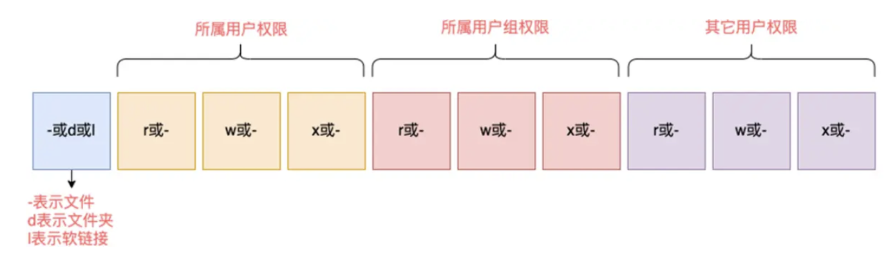

# Linux用户和权限

## 1、su(Switch User)和exit命令

su  [-]  [用户名]

- -符号是可选的，表示是否在切换用户后加载环境变量，建议带上
- 参数：用户名，表示要切换的用户，用户名也可以省略，省略表示切换到root
- 切换用户后，可以通过exit命令退回上一个用户，也可以使用快捷键：ctrl + d

sudo  其它命令：为命令临时赋予root权限。但是不是所有用户，都有权利使用sudo， 需要为普通用户配置sudo认证。

## 2、用户、用户组

Linux系统中可以：

- 配置多个用户
- 配置多个用户组
- 用户可以加入多个用户组中

Linux中关于权限的管控级别有2个级别，分别是：针对用户的权限控制，针对用户组的权限控制

## 3、用户组管理

以下命令需root用户执行

- 创建用户组：groupadd 用户组名
- 删除用户组：groupdel 用户组名

4、用户管理

以下命令需root用户执行

| 命令                      | 选项                                                         | 功能                     |
| ------------------------- | ------------------------------------------------------------ | ------------------------ |
| useradd [-g -d] 用户名    | 选项：-g指定用户的组，不指定-g，会创建同名组并自动加入，指定-g需要组已经存在。如已存在同名组，必须使用-g；<br />选项：-d指定用户HOME路径，不指定，HOME目录默认在：/home/用户民 | 创建用户                 |
| userdel [-r] 用户名       | 选项：-r，删除用户的HOME目录，不使用-r，删除用户时，HOME目录保留 | 删除用户                 |
| id [用户名]               | 参数：用户名，被查看的用户，如果不提供则查看自身             | 查看用户所属组           |
| usermod -aG 用户组 用户名 |                                                              | 将制定用户加入制定用户组 |
| getent password           |                                                              | 查看当前系统中有哪些用户 |

## 4、权限信息



举例：drwxr-xr-x，表示：

- 这是一个文件夹，首字母d表示
- 所属用户(右上角图序号2)的权限是：有r有w有x，rwx
- 所属用户组(右上角图序号3)的权限是：有r无w有x，r-x （-表示无此权限）
- 其它用户的权限是：有r无w有x，r-x

| 权限        | 文件               | 文件夹                                 |
| ----------- | ------------------ | -------------------------------------- |
| r--读权限   | 查看文件内容       | 查看文件夹内容，如ls命令               |
| w--写权限   | 修改此文件         | 可以在文件夹内：创建、删除、改名等操作 |
| x--执行权限 | 将文件作为程序执行 | 可以更改工作目录到此文件夹，即cd进入   |

## chmod

我们可以使用chmod命令，修改文件、文件夹的权限信息。注意，只有文件、文件夹的所属用户或root用户可以修改。

chmod [-R] 权限 文件或文件夹

- 选项：-R，对文件夹内的全部内容应用同样的操作

```python
# 将文件权限修改为：rwxr-x--x
chmod u=rwx,g=rx,o=x hello.txt 
•其中：u表示user所属用户权限，g表示group组权限，o表示other其它用户权限

# 将文件夹test以及文件夹内全部内容权限设置为：rwxr-x--x
chmod -R u=rwx,g=rx,o=x test，

# 除此之外，还有快捷写法：
chmod 751 hello.txt

# 将hello.txt的权限修改为751
```

### 数字的含义

权限可以用3位数字来代表，第一位数字表示用户权限，第二位表示用户组权限，第三位表示其它用户权限。

数字的细节如下：r记为4，w记为2，x记为1

## chown

使用chown命令，可以修改文件、文件夹的所属用户和用户组
普通用户无法修改所属为其它用户或组，所以此命令只适用于root用户执行

```python
# 语法：
chown [-R] [用户][:][用户组] 文件或文件夹
    •选项，-R，同chmod，对文件夹内全部内容应用相同规则
    •选项，用户，修改所属用户
    •选项，用户组，修改所属用户组
    •:用于分隔用户和用户组

# 示例：
# 将hello.txt所属用户修改为root
chown root hello.txt

# 将hello.txt所属用户组修改为root
chown :root hello.txt

# 将hello.txt所属用户修改为root，用户组修改为itheima
chown root:itheima hello.txt

# 将文件夹test的所属用户修改为root并对文件夹内全部内容应用同样规则
chown -R root test
```

