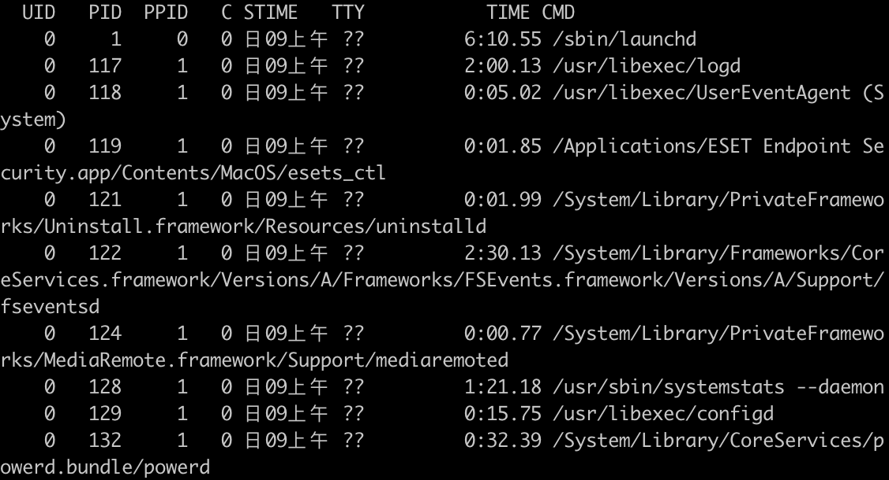
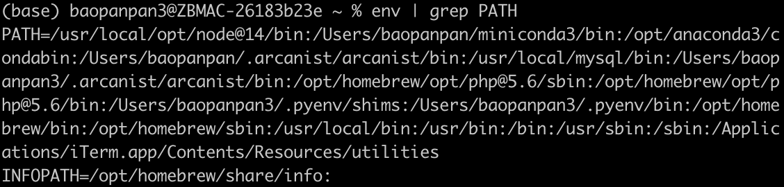

# Linux实用操作

## 1、基础命令

| 命令      | 作用                                                         | 备注                                                         |
| --------- | ------------------------------------------------------------ | ------------------------------------------------------------ |
| ctrl + c  | 强制停止程序(命令)运行                                       |                                                              |
| ctrl + d  | 退出账户的登陆<br />退出某些特定程序的专属页面(python)       | 不能用于退出vim                                              |
| history   | 历史输入过的命令                                             |                                                              |
| ctrl + r  | 输入内容去匹配历史命令                                       | 如果搜索到的内容是你需要的，那么<br />回车可以直接执行<br />键盘左右键，可以得到此命令(不执行) |
| !命令前缀 | 自动执行上一次匹配前缀的命令                                 |                                                              |
|           | ctrl + a，跳到命令开头<br />ctrl + e，跳到命令结尾<br />ctrl + 键盘左键，向左跳一个单词<br />ctrl + 键盘右键，向右跳一个单词 | 光标移动快捷键                                               |
|           | ctrl + l<br />clear                                          | 清屏                                                         |
|           |                                                              |                                                              |
|           |                                                              |                                                              |
|           |                                                              |                                                              |

## 2、使用yum为CentOS系统安装软件

#### **操作系统安装软件分为**：

- 下载安装包自行安装
- 系统的应用商店内安装

yum：RPM包软件管理器，用于自动化安装配置Linux软件，并可以自动解决依赖问题(**对应Mac中brew**)

语法：yum  [-y]  [install | remove | search]  软件名称

- 选项：-y，自动确认，无需手动确认安装或卸载过程
- install：安装
- remove：卸载
- search：搜索

#### **使用apt为Ubuntu安装软件**

语法：apt  [-y]  [install | remove | search]  软件名称

## 3、systemctl命令

Linux系统很多软件(内置或第三方)均支持使用systemctl命令控制：启动、停止、开机自启

能够被systemctl管理的软件，一般也称之为：服务

语法：systemctl  start ｜ stop ｜status ｜ enable ｜ disable 服务名

## 4、ln命令创建软连接

 在系统中创建软链接，可以将文件、文件夹链接到其它位置。类似windows中**快捷方式**

语法：ln  -s  参数1  参数2

- -s选项，创建软链接
- 参数1:被链接的文件或文件夹
- 参数2:要链接去的目的地

eg：ln -s /etc/yum ~/yum

## 5、date命令

通过date命令可以在命令行中查看系统的时间

语法：date  [-d]  [+格式化字符串]

- -d按照给定的字符串显示日期，一般用于日期计算
- 格式化字符串：通过特定的字符串标记，来控制显示的日期格式
  - %Y：年
  - %y：年份后两位数字
  - %m：月份
  - %d：日
  - %H：小时
  - %M：分钟
  - %S：秒
  - %s：自1970-01-01 00:00:00 UTC到现在的秒数

eg：date -d "+1 day" +%Y%m%d

**修改Linux时区**

如果date查看的日期不准，可能因为默认时区不是中国的东八区。

使用root权限，执行如下命令：

```python
rm -f /etc/localtime
sudo ln -s /usr/share/zoneinfo/Asia/Shanghai /etc/localtime
```

## 6、IP和主机名

- hostname查看主机名
- hostnamectl set-hostname 主机名，修改主机名（需root）

## 7、网络传输

### 下载和网络请求

#### ping命令

可以通过ping命令，检查指定的网络服务器是否是可联通状态。

语法：ping [-c num] ip或主机名

- 选项：-c，检查次数，不使用-c选项，将无限次数持续检查
- 参数：ip或主机名，被检查的服务器的ip地址或者主机名地址

#### wget命令

wget是非交互式的文件下载器，可以在命令行内下载网络文件。

语法：wget [-b] url

- 选项：-b，可选，后台下载，会将日志写入到当前工作目录的wget-log文件
- 参数：url，下载链接

#### curl命令

curl可以发送http网络请求，可用于：下载文件、获取信息等

语法：curl [-o] url 

- 选项：-o，用于下载文件，当URL是下载链接时，可以使用此项保存文件
- 参数：url，要发起请求的网络地址

### 端口

端口，是设备与外界通讯交流的出入口，端口可以分为：物理端口和虚拟端口两类。

- 物理端口：又称之为接口，是可见的端口，如USB接口，HDMI端口等；
- 虚拟端口：是指计算机内部的端口，是不可见的，用来操作系统和外部进行交互使用的；

通过端口可以锁定计算机上具体的程序，确保程序之间进行沟通。

**分类：**

Linux系统可以支持65535个端口，这6万多个端口分为3类进行使用：

- 公认端口：1-1023，通常用于一些系统内置或知名程序的预留使用，如SSH服务的22端口，https服务的443端口等，非特殊需要，不要占用这个范围的端口；
- 注册端口：1024-49151，通常可以随意使用，用于松散的绑定一些程序/服务；
- 动态端口：49152-65535，通常不会固定绑定程序，而是当程序对外进行网络连接时，用于临时使用；

**可以通过nmap命令，安装nmap：yum -y install nmap**

**语法：nmap 被查看的ip地址，如nmap 127.0.0.1查看本机端口占用**

**可以通过netstat命令，查看指定端口的占用情况**

**语法：netstat -anp|grep 端口号，安装netstat: yum -y install net-tools** 

## 8、进程

程序运行在操作系统中，是被操作系统所管理的。

为管理运行的程序，每一个程序在运行的时候，便被操作系统注册为系统中的一个进程，并会为每一个进程都分配一个独有的进程ID。

#### 查看进程

可以通过ps命令查看Linux系统中的进程信息

语法：ps [-e -f]

- 选项：-e，显示全部进程
- 选项：-f，以完全格式化的形式展示信息

一般来说，固定用法就是：ps -ef列出全部进程的全部信息



从左到右分别是：

- UID：进程所属的用户ID
- PID：进程的进程号ID
- PPID：进程的父ID（启动此进程的其它进程）
- C：此进程CPU占用率
- STIME：进程的启动时间
- TTY：启动此进程的终端序号，如显示？，表示非终端启动
- TIME：进程占用CPU的时间
- CMD：进程相应的名称或启动路径或启动命令

#### 关闭进程

通过kill命令关闭进程。

语法：kill [-9] 进程ID

选项：-9，表示强制关闭进程，不使用此选项会向进程发送信号要求其关闭，但是是否关闭看进程自身的处理机制。

## 9、主机状态

#### 查看系统资源占用

可用通过top命令查看CPU、内存使用情况。

默认每5s刷新一次，语法：直接输入top即可

top命令选项：

| 选项 | 功能                                                         |
| ---- | ------------------------------------------------------------ |
| -p   | 只显示某个进程的信息                                         |
| -d   | 设置刷新时间，默认是5s                                       |
| -c   | 显示产生进程的完整命令，默认是进程名                         |
| -n   | 指定刷新次数，比如top -n 3，刷新输出3次后退出                |
| -b   | 以非交互非全屏模式运行，以批次的方式执行top，一般配置-n指定输出几次统计信息，将输出重定向到指定文件，如top -b -n 3 > /tmp/top.tmp |
| -i   | 不显示任何闲置（idle）或无用（zombie）的进程                 |
| -u   | 查找特定用户启动的进程                                       |

#### 磁盘信息监控

1、使用df命令，可以查看硬盘的使用情况

语法：df [-h]

选项：-h，以更加人性化的单位展示

2、可以使用iostat查看cpu、磁盘的相关信息

语法：iostat [-x] [num1] [num2]

- 选项：-x，显示更多信息
- num1：数字，刷新间隔，num2：数字，刷新几次 

#### 网络状状态监控

可以使用sar命令查看网络的相关统计（sar命令非常复杂，这里仅简单用于统计网络）

语法：sar -n DEV num1 num2 

选项：-n，查看网络，DEV表示查看网络接口

num1：刷新间隔（不填就查看一次结束），num2：查看次数（不填无限次数）

## 10、环境变量

环境变量是操作系统在运行的时候，记录的一些关键性信息，用以辅助系统运行。

在Linux系统中执行：env命令即可查看当前系统中记录的环境变量。环境变量是一种keyvalue型结构

#### 环境变量：PATH



PATH记录了系统执行任何命令的搜索路径，路径之间以:隔开。执行任何命令，都会按照顺序，从上述路径中搜索要执行的程序的本体。

#### $符号

在Linux系统中，$符号被用于取“变量”的值。

环境变量记录的信息，除了给操作系统自己使用外，如果我们想要取用，也可以使用。

取得环境变量的值就可以通过语法：$环境变量名 来取得。

如：echo $PATH 

或   echo ${PATH}ABC，和其它内容混合在一起的时候，可以通过{}来标准取的变量是谁。

#### 自行设置环境变量

Linux环境变量可以用户自行设置，其中分为：

- 临时设置，语法：export 变量名=变量值
- 永久生效
  - 针对当前用户生效，配置在当前用户的：~/.bashrc文件中
  - 针对所有用户生效，配置在系统的：/etc/profile文件中
  - 并通过语法：source配置文件，进行立刻生效

## 11、上传和下载

#### rz、sz命令

- rz命令，进行上传，语法：直接输入rz即可
- sz命令进行下载，语法：sz要下载的文件

## 12、压缩和解压

#### 压缩格式

市面上有非常多的压缩格式：

- zip格式：Linux、Windows、macOS，常用
- 7zip：Windows系统常用
- rar：Windows系统常用
- tar：Linux、macOS常用
- gzip：Linux、macOS常用

#### tar命令

Linux和Mac系统常用有2种压缩格式，后缀名分别是：

- .tar，称之为tarball，归档文件，即简单的将文件组装到一个.tar文件内，并没有太多文件体积的减少，仅仅是简单的封装
- .gz，也常见为.tar.gz，gzip格式压缩文件，即使用gzip压缩算法将文件压缩到一个文件内，可以极大的减少压缩后的体积

针对这两种格式，使用tar命令均可以进行压缩和解压缩的操作

语法：tar [-c -v -x -f -z -C] 参数1 参数2 ...... 参数N

- -c：创建压缩文件，用于压缩格式
- -v：显示压缩、解压过程，用于查看进度
- -x：解压模式
- -f：要创建的文件，或要解压的文件，-f选项必须在所有选项中位置处于最后一个
- -z：gzip模式，不使用-z就是普通的tarball格式
- -C：选择解压的目的地，用于解压模式

#### tar命令压缩

常用组合：

- tar -cvf test.tar 1.txt 2.txt 3.txt，将1.txt 2.txt 3.txt压缩到test.tar文件内
- tar -zcvf test.tar.gz 1.txt 2.txt 3.txt，将1.txt 2.txt 3.txt压缩到test.tar.gz文件内，使用gzip模式

#### tar命令解压

常用组合：

- tar -xvf test.tar，解压test.tar，将文件解压到当前目录
- tar -xvf test.tar -C /home/xxx，解压test.tar，将文件解压到指定目录
- tar -zxvf test.tar.gz -C /home/xxx，以gzip模式解压test.tar.gz，将文件解压至指定目录

#### zip压缩命令

可以使用zip命令，压缩文件为zip压缩包

语法：zip [-r] 参数1 参数2 ...... 参数N，-r，被压缩的包含文件夹的时候，需要使用-r选项

示例：

- zip test.zip a.txt b.txt c.txt，将a.txt b.txt c.txt压缩到test.zip文件内
- zip -r test.zip test a.txt，将test文件夹和a.txt文件压缩到test.zip文件内

#### unzip命令解压文件

使用unzip命令，可以方便的解压zip压缩包

语法：unzip [-d] 参数

- -d，指定要解压去的位置，同tar的-C选项
-  参数，被解压的zip压缩包文件

示例：

- unzip test.zip，将test.zip解压到当前目录
- unzip test.zip -d /home/xxx，将test.zip解压到指定文件夹内
