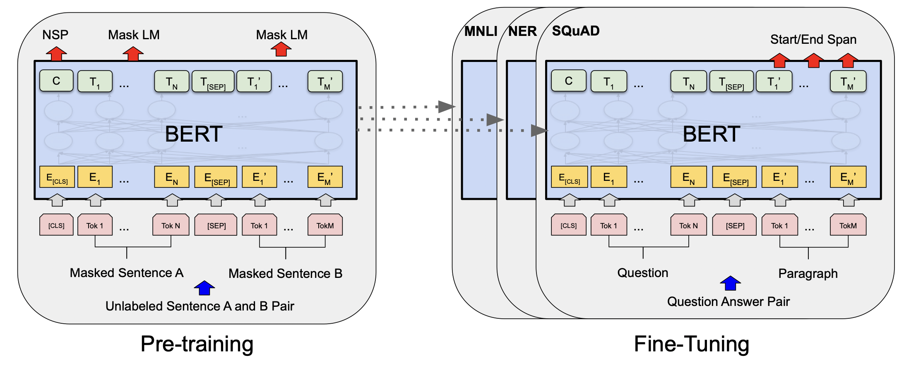
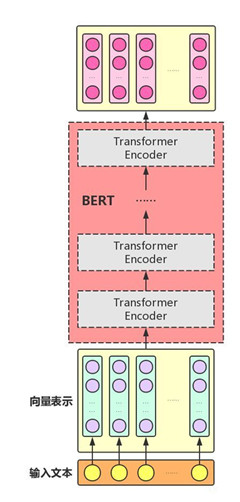
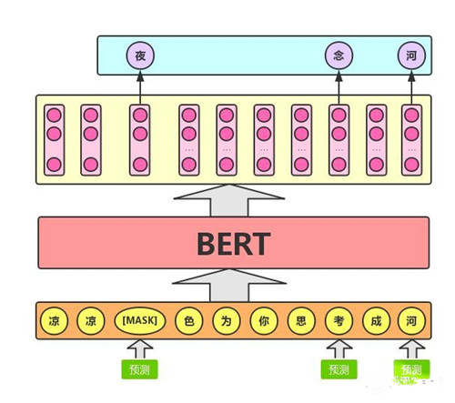
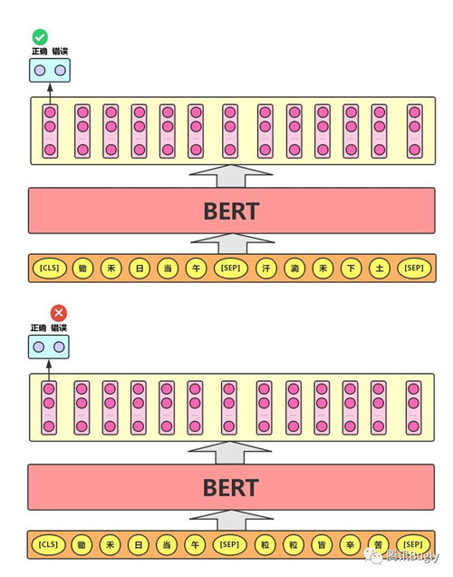

https://www.cnblogs.com/gczr/p/11785930.html

 

https://zhuanlan.zhihu.com/p/166546529

#### 1.BERT 的基本原理是什么？

BERT 来自 Google 的论文Pre-training of Deep Bidirectional Transformers for Language Understanding；

BERT 是“Bidirectional Encoder Representations from Transformers”的首字母缩写，整体是一个自编码语言模型（Autoencoder LM），并且其设计了两个任务来预训练该模型。

**Bert这种两阶段的模式（预训练+Fine-tuning）**

- 第一个任务是采用 MaskLM 的方式来训练语言模型，通俗地说就是在输入一句话的时候，随机地选一些要预测的词，然后用一个特殊的符号[MASK]来代替它们，之后让模型根据所给的标签去学习这些地方该填的词。

- 第二个任务在双向语言模型的基础上额外增加了一个句子级别的连续性预测任务，即预测输入 BERT 的两段文本是否为连续的文本，引入这个任务可以更好地让模型学到连续的文本片段之间的关系。

最后的实验表明 BERT 模型的有效性，并在 11 项 NLP 任务中夺得 SOTA 结果。

BERT 相较于原来的 RNN、LSTM 可以做到并发执行，同时提取词在句子中的关系特征，并且能在多个不同层次提取关系特征，进而更全面反映句子语义。相较于 word2vec，其又能根据句子上下文获取词义，从而避免歧义出现。同时缺点也是显而易见的，模型参数太多，而且模型太大，少量数据训练时，容易过拟合。

#### 二.BERT 是怎么用 Transformer 的？

BERT 只使用了 Transformer 的 Encoder 模块，原论文中，作者分别用 12 层和 24 层 Transformer Encoder 组装了两套 BERT 模型，分别是：

其中层的数量(即，Transformer Encoder 块的数量)为L ，隐藏层的维度为H ，自注意头的个数为A 。在所有例子中，我们将前馈/过滤器(Transformer Encoder 端的 feed-forward 层)的维度设置为4H ，即当 H=768 时是3072 ；当 H=1024 是 4096 。

图示如下：

需要注意的是，与 Transformer 本身的 Encoder 端相比，BERT 的 Transformer Encoder 端输入的向量表示，多了 Segment Embeddings。

#### **三、BERT的预训练结构**

BERT实际上是一个语言模型。语言模型通常采用大规模、与特定NLP任务无关的文本语料进行训练，其目标是学习语言本身应该是什么样的。BERT模型其预训练过程就是逐渐调整模型参数，使得模型输出的文本语义表示能够刻画语言的本质，便于后续针对具体NLP任务作微调。

1、**Masked LM**

Masked LM的任务描述为：给定一句话，随机抹去这句话中的一个或几个词，要求根据剩余词汇预测被抹去的几个词分别是什么，如下图所示

具体来说，文章作者在一句话中随机选择15%的词汇用于预测。对于在原句中被抹去的词汇，80%情况下采用一个特殊符号[MASK]替换，10%情况下采用一个任意词替换，剩余10%情况下保持原词汇不变。这么做的主要原因是：在后续微调任务中语句中并不会出现[MASK]标记，而且这么做的另一个好处是：预测一个词汇时，模型并不知道输入对应位置的词汇是否为正确的词汇（10%概率），这就迫使模型更多地依赖于上下文信息去预测词汇，并且赋予了模型一定的纠错能力。

<u>BERT 模型的这个预训练过程其实就是在模仿我们学语言的过程，思想来源于「完形填空」的任务。具体来说，文章作者在一句话中随机选择 15% 的词汇用于预测。对于在原句中被抹去的词汇， 80% 情况下采用一个特殊符号 [MASK] 替换， 10% 情况下采用一个任意词替换，剩余 10% 情况下保持原词汇不变。</u>

<u>这么做的主要原因是：在后续微调任务中语句中并不会出现 [MASK] 标记，而且这么做的另一个好处是：预测一个词汇时，模型并不知道输入对应位置的词汇是否为正确的词汇（ 10% 概率），这就迫使模型更多地依赖于上下文信息去预测词汇，并且赋予了模型一定的纠错能力。上述提到了这样做的一个缺点，其实这样做还有另外一个缺点，就是每批次数据中只有 15% 的标记被预测，这意味着模型可能需要更多的预训练步骤来收敛。</u>

2、**NextSentence Prediction**

任务描述为：给定一篇文章中的两句话，判断第二句话在文本中是否紧跟在第一句话之后，如下图所示：

