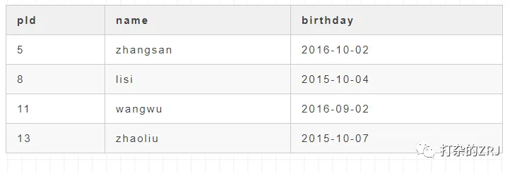
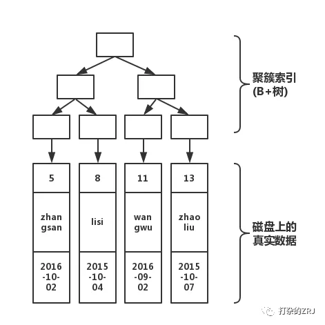

# MySQL(Innodb)索引的原理

https://mp.weixin.qq.com/s?__biz=MzIwMDgzMjc3NA==&mid=2247484040&idx=1&sn=5918c27351f366a777484b440aeeaa22&chksm=96f660e1a181e9f7e9dc6f6b0570352c20650c9de51ffbd236e0d71d4edaf99805334361ac72&scene=21#wechat_redirect

本文内容只在Mysql的Innodb引擎中是成立的。在Sql Server、oracle、Mysql的Mysiam引擎中的正确性，不一定成立！


在Innodb中，**聚簇索引**默认就是**主键索引**。

在Innodb中，Mysql中的数据是按照主键的顺序来存放的。那么聚簇索引就是按照每张表的主键来构造一颗B+树，叶子节点存放的就是整张表的行数据。

**如果没有主键**，则按照下列规则来建聚簇索引

- 没有主键时，会用一个唯一且不为空的索引列做为主键，成为此表的聚簇索引
- 如果没有这样的索引，InnoDB会隐式定义一个主键来作为聚簇索引。


**自增主键和uuid作为主键的区别？**

由于主键使用了聚簇索引，如果主键是自增id，，那么对应的数据一定也是相邻地存放在磁盘上的，写入性能比较高。如果是uuid的形式，频繁的插入会使innodb频繁地移动磁盘块，写入性能就比较低了。


### 索引原理介绍

先来一张带主键的表，如下所示，pId是主键



接下来，我们画出该表的结构图如下



如上图所示，分为上下两个部分，上半部分是由主键形成的B+树，下半部分就是磁盘上真实的数据！那么，当我们， 执行下面的语句

```
select * from table where pId='11'
```

那么，执行过程如下


如上图所示，从根开始，经过3次查找，就可以找到真实数据。如果不使用索引，那就要在磁盘上，进行逐行扫描，直到找到数据位置


**接下来引入非聚簇索引**

我们执行下面的语句

```
create index index_name on table(name);
```

此时结构图如下所示


会根据你的索引字段生成一颗新的B+树。

因此， 我们每加一个索引，就会增加表的体积， 占用磁盘存储空间。

然而，**注意看叶子节点**，非聚簇索引的叶子节点并不是真实数据，它的**叶子节点依然是索引节点**，存放的是该**索引字段的值**以及对应的**主键索引(聚簇索引)**。


如果我们执行下列语句

```
select * from table where name='lisi'
```

此时结构图如下所示


通过上图红线可以看出，先从非聚簇索引树开始查找，然后找到聚簇索引后。根据聚簇索引，在聚簇索引的B+树上，找到完整的数据！

如果需要通过聚簇索引才能找到完整数据，则称“**回表**”；

如果仅仅通过非聚簇索引就能找到所需数据，称“**索引覆盖**”，Extra中为Using index;


那么这个时候，我们执行了下述语句，又会发生什么呢？

```
create index index_birthday on table(birthday);
```

此时结构图如下


看到了么，多加一个索引，就会多生成一颗非聚簇索引树。

因此，索引不能乱加。因为，有几个索引，就有几颗非聚簇索引树！你在做插入操作的时候，需要同时维护这几颗树的变化！因此，如果索引太多，插入性能就会下降!