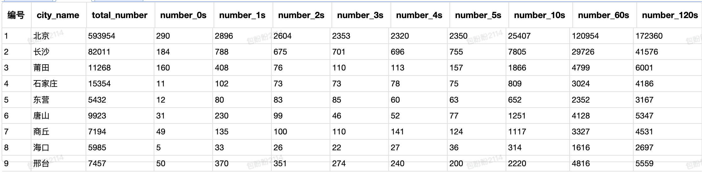

# Case When和聚合函数count、sum的使用

```sql
select city_name, count(*) as total_number,
count(case when peroid_time=0 then 1 else null end) as number_0s,
count(case when peroid_time=1 then 1 else null end) as number_1s,
count(case when peroid_time=2 then 1 else null end) as number_2s,
count(case when peroid_time=3 then 1 else null end) as number_3s,
count(case when peroid_time=4 then 1 else null end) as number_4s,
count(case when peroid_time=5 then 1 else null end) as number_5s,
count(case when peroid_time<=10 then 1 else null end) as number_10s,
count(case when peroid_time<=60 then 1 else null end) as number_60s,
count(case when peroid_time<=120 then 1 else null end) as number_120s
FROM
(
select delivery_id,
bill_id,
transporter_id,
delivery_status,
create_time,
cancel_time,
unix_timestamp(cancel_time)-unix_timestamp(create_time) as peroid_time,
order_cancel_reason,
city_id,
city_name
from algo_test.tmp_sxy_free_zhipai_test_0314_order_01
where delivery_category='企业版'
and city_id in (13, 140, 2, 30,159, 171, 178, 209, 336)
and transporter_id=-99
and test_flag='实验组'
and order_cancel_reason='被其他平台抢单') as t
group by city_name
;

```

