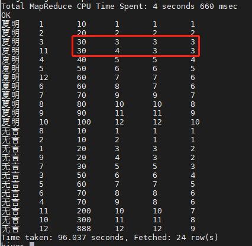
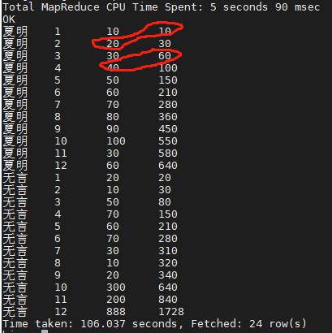
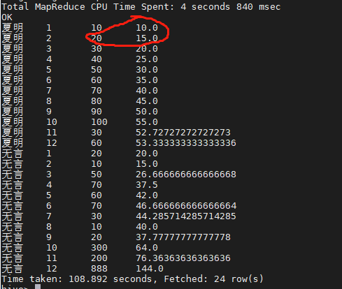
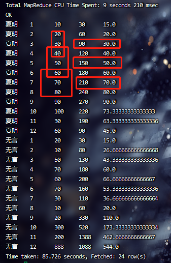

https://blog.csdn.net/zhaomengszu/article/details/124084628

**avg()、sum()、max()、min()是分析函数，而over()才是窗口函数**

## 什么是[窗口函数](https://so.csdn.net/so/search?q=窗口函数&spm=1001.2101.3001.7020)

窗口函数是用于分析用的一类函数，要理解窗口函数要先从[聚合函数](https://so.csdn.net/so/search?q=聚合函数&spm=1001.2101.3001.7020)说起。 大家都知道聚合函数是将某列中多行的值合并为一行，比如sum、count等。 而窗口函数则可以在本行内做运算，得到多行的结果，即每一行对应一行的值。 通用的窗口函数可以用下面的语法来概括

```sql
Function() Over (Partition By Column1，Column2，Order By Column3)
```

分组排序:

```sql
select * ,
row_number() over(partition by name order by cnt asc) as rmp，
rank() over(partition by name order by cnt asc) as rp,
dense_rank() over(partition by name order by cnt asc) as drp 
from over_test;
```



分组累计求和:

```sql
select * ,
sum(cnt) over(partition by name order by month asc) as sum_cnt 
from over_test;
```

 

分组求平均数:

```sql
select * ,
avg(cnt) over(partition by name order by month asc) as avg_cnt 
from over_test;
```



分组滑动:

```sql
select * ,
sum(cnt) over(partition by name order by month asc rows between 1 preceding and 1 following) as sum_cnt ,
avg(cnt) over(partition by name order by month asc rows between 1 preceding and 1 following) as avg_cnt 
from over_test;
```



# lead()/lag()

lag()与lead函数是跟偏移量相关的两个分析函数

通过这两个函数可以在一次查询中取出同一字段的前N行的数据(lag)和后N行的数据(lead)作为独立的列,从而更方便地进行进行数据过滤，该操作可代替表的自联接，且效率更高

**lag()/lead()**
　　lead(field, num, defaultvalue)
　　　　field: 需要查找的字段
　　　　num: 往后查找的num行的数据
　　　　defaultvalue: 没有符合条件的默认值

**over()**
　　表示lag()与lead()操作的数据都在over()的范围内，里面可以使用以下子句
　　　　partition by 语句(用于分组)
　　　　order by 语句()用于排序)
　　如：over(partition by a order by b) 表示以a字段进行分组，再以b字段进行排序，对数据进行查询