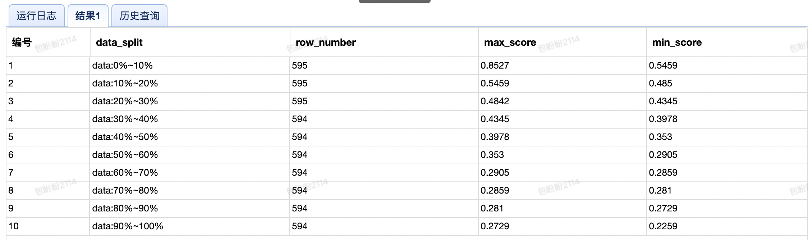

#### 1、**Json解析**

get_json_object(goodslist,'$.[0:].id')

 

2、**列转行 https://zhuanlan.zhihu.com/p/115913870**

lateral view explode

explode作用：处理map结构的字段，将数组转换成多行

LATERAL VIEW函数：笛卡尔积

```SQL
select wid, merchant_id, goodsid, recommendType, label, rec_id from 
(select * from data_model.wsc_recommend_click_expose_recall) as t 
lateral view explode(split(regexp_replace(recId, '}|\\{', ''), ',')) recId as rec_id
```


#### **行转列** https://blog.csdn.net/jsbylibo/article/details/82859168

拼接函数：

***\*concat(string s1, string s2, string s3)\****

***\*concat_ws(seperator, string s1, string s2...)\*******\*:\*******\*常常结合group by与collect_set使用\****

 

https://blog.csdn.net/weixin_34234823/article/details/91480106

##### 3、**find_in_set(str, strlist)  strlist以逗号分割**

SELECT FIND_IN_SET('b', 'a,b,c,d'); 


#### 4、hive中select *中不包括某些列

https://cloud.tencent.com/developer/article/1544732

我们可以使用正则表达式来排除某些列。如果要使用正则表达式，需要将属性 `hive.support.quoted.identifiers` 设置为 `none`。

如果我们不想要 `event_ts` 这一列。我们会使用如下查询来排除这一列:

```javascript
SELECT `(event_ts)?+.+` FROM <table>;
```

上面语句等价于:

```javascript
SELECT user_id, event_tm, os, os_version, app_version, ..., prov, city
FROM <table>;
```

如果我们不想要 `event_ts` 和 `event_tm` 两列。我们会使用如下查询来排除这两列:

```javascript
SELECT `(event_ts|event_tm)?+.+` FROM <table>;
```

如果我们要排除多列，使用 `|` 分割。


#### 5、hive中分区插入

动态插入语法 ：

[](javascript:void(0);)

```SQL
insert overwrite table tb_test (biz_date)

select col_a,

col_b,

.....

col_last,

col_date  --这个字段不是实际插入到表中的哦，只是用来标识根据此字段的值来插入到不同的分区中

from tb_test0
```

静态分区插入：

```SQL
INSERT into test.ora2hive PARTITION(pday='2020-05-08') VALUES(8,'h',2341.23,'2020/05/08 12:24:32')
```


### NTILE(n)

- 用于将分组数据按照顺序切分成n片，返回当前记录所在的切片值

NTILE不支持ROWS BETWEEN，比如 NTILE(2) OVER(PARTITION BY cookieid ORDER BY createtime ROWS BETWEEN 3 PRECEDING AND CURRENT ROW)

- 如果切片不均匀，默认增加第一个切片的分布
- 经常用来取前30% 带有百分之多少比例的记录什么的

```sql
select 
  concat("data:",10*(bucket_index-1), "%~",bucket_index*10, "%" ) as data_split,
  COUNT(*) as row_number,
  max(same_way_score) as max_score,
  min(same_way_score) as min_score
from 
(
select
  NTILE(10) OVER (order by same_way_score desc) as bucket_index,
  same_way_score,
  logging_time
from
  (
    select
      get_json_object(data, "$.filter_step") as filter_step,
      get_json_object(data, "$.same_way_score") as same_way_score,
      logging_time
    from
      dada_log.dos_biz_log
    where
      dt = '2021-11-22'
      and biz_type = 10259
      and get_json_object(data, "$.filter_step")='filter_same_way_score_inshop_assign'
      and get_json_object(data, "$.supplier_group_id") in (
    100006440,
    100005471,
    100006810,
    100006808,
    100005657,
    100005469
  )
  ) as t
) as t1 group by bucket_index;
```


