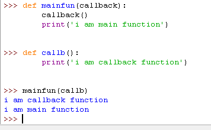
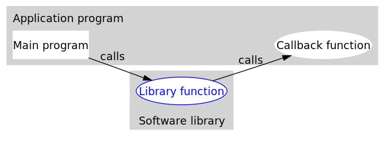

https://www.cnblogs.com/baxianhua/p/10756001.html

***优点：***

***1.解藕***

***2.灵活，在处理相似事件的时候可以灵活的使用不同的方法***


回调的英文定义：

A callback is a function that is passed as an argument to another function and is executed after its parent function has completed。

字面上的理解，回调函数就是一个参数，将这个函数作为参数传到另一个函数里面，当那个函数执行完之后，再执行传进去的这个函数。这个过程就叫做回调。

其实也很好理解对吧，回调，回调，就是回头调用的意思。主函数的事先干完，回头再调用传进来的那个函数。但是以前看过很多博客，他们总是将回调函数解释的云里雾里，很高深的样子。

举一个别人举过的例子：约会结束后你送你女朋友回家，离别时，你肯定会说：“到家了给我发条信息，我很担心你。” 对不，然后你女朋友回家以后还真给你发了条信息。小伙子，你有戏了。其实这就是一个回调的过程。你留了个参数函数（要求女朋友给你发条信息）给你女朋友，然后你女朋友回家，回家的动作是主函数。她必须先回到家以后，主函数执行完了，再执行传进去的函数，然后你就收到一条信息了。

 




https://www.cnblogs.com/-wenli/p/10970136.html

**什么是回调函数？**

我们绕点远路来回答这个问题。

编程分为两类：系统编程（system programming）和应用编程（application programming）。所谓系统编程，简单来说，就是编写**库**；而应用编程就是利用写好的各种库来编写具某种功用的程序，也就是**应用**。系统程序员会给自己写的库留下一些接口，即API（application programming interface，应用编程接口），以供应用程序员使用。所以在抽象层的图示里，库位于应用的底下。

当程序跑起来时，一般情况下，应用程序（application program）会时常通过API调用库里所预先备好的函数。但是有些库函数（library function）却要求应用先传给它一个函数，好在合适的时候调用，以完成目标任务。这个被传入的、后又被调用的函数就称为**回调函数**（callback function）。

打个比方，有一家旅馆提供叫醒服务，但是要求旅客自己决定叫醒的方法。可以是打客房电话，也可以是派服务员去敲门，睡得死怕耽误事的，还可以要求往自己头上浇盆水。这里，“叫醒”这个行为是旅馆提供的，相当于库函数，但是叫醒的方式是由旅客决定并告诉旅馆的，也就是回调函数。而旅客告诉旅馆怎么叫醒自己的动作，也就是把回调函数传入库函数的动作，称为**登记回调函数**（to register a callback function）。如下图所示（图片来源：维基百科）：

 

可以看到，回调函数通常和应用处于同一抽象层（因为传入什么样的回调函数是在应用级别决定的）。而回调就成了一个高层调用底层，底层再回过头来调用高层的过程。（我认为）这应该是回调最早的应用之处，也是其得名如此的原因。

 

**回调机制的优势**

从上面的例子可以看出，回调机制提供了非常大的灵活性。请注意，从现在开始，我们把图中的库函数改称为**中间函数**了，这是因为回调并不仅仅用在应用和库之间。任何时候，只要想获得类似于上面情况的灵活性，都可以利用回调。

这种灵活性是怎么实现的呢？乍看起来，回调似乎只是函数间的调用，但仔细一琢磨，可以发现两者之间的一个关键的不同：在回调中，我们利用某种方式，把回调函数像参数一样传入中间函数。可以这么理解，在传入一个回调函数之前，中间函数是不完整的。换句话说，程序可以在运行时，通过登记不同的回调函数，来决定、改变中间函数的行为。这就比简单的函数调用要灵活太多了。请看下面这段Python写成的回调的简单示例：


```python
even.py
#回调函数1
#生成一个2k形式的偶数
def double(x):
    return x * 2
    
#回调函数2
#生成一个4k形式的偶数
def quadruple(x):
    return x * 4
```


`callback_demo.py`

```python
from even import *

#中间函数
#接受一个生成偶数的函数作为参数
#返回一个奇数
def getOddNumber(k, getEvenNumber):
    return 1 + getEvenNumber(k)
    
#起始函数，这里是程序的主函数
def main():    
    k = 1
    #当需要生成一个2k+1形式的奇数时
    i = getOddNumber(k, double)
    print(i)
    #当需要一个4k+1形式的奇数时
    i = getOddNumber(k, quadruple)
    print(i)
    #当需要一个8k+1形式的奇数时
    i = getOddNumber(k, lambda x: x * 8)
    print(i)
    
if __name__ == "__main__":
    main()
```


运行`callback_demp.py`，输出如下：

```text
3
5
9
```

上面的代码里，给`getOddNumber`传入不同的回调函数，它的表现也不同，这就是回调机制的优势所在。值得一提的是，上面的第三个回调函数是一个匿名函数。

**易被忽略的第三方**

通过上面的论述可知，中间函数和回调函数是回调的两个必要部分，不过人们往往忽略了回调里的第三位要角，就是中间函数的调用者。绝大多数情况下，这个调用者可以和程序的主函数等同起来，但为了表示区别，我这里把它称为**起始函数**（如上面的代码中注释所示）。

之所以特意强调这个第三方，是因为我在网上读相关文章时得到一种印象，很多人把它简单地理解为两个个体之间的来回调用。譬如，很多中文网页在解释“回调”（callback）时，都会提到这么一句话：“If you call me, I will call you back.”我没有查到这句英文的出处。我个人揣测，很多人把起始函数和回调函数看作为一体，大概有两个原因：第一，可能是“回调”这一名字的误导；第二，给中间函数传入什么样的回调函数，是在起始函数里决定的。实际上，回调并不是“你我”两方的互动，而是ABC的三方联动。有了这个清楚的概念，在自己的代码里实现回调时才不容易混淆出错。

另外，回调实际上有两种：阻塞式回调和延迟式回调。两者的区别在于：阻塞式回调里，回调函数的调用一定发生在起始函数返回之前；而延迟式回调里，回调函数的调用有可能是在起始函数返回之后。这里不打算对这两个概率做更深入的讨论，之所以把它们提出来，也是为了说明强调起始函数的重要性。网上的很多文章，提到这两个概念时，只是笼统地说阻塞式回调发生在主调函数返回之前，却没有明确这个主调函数到底是起始函数还是中间函数，不免让人糊涂，所以这里特意说明一下。另外还请注意，本文中所举的示例均为阻塞式回调。延迟式回调通常牵扯到多线程。

 

在Python中的一些使用示例：

## **实例一**


```python
import random as rd

# -----------被调用方----------------------------
def newRN(fn):  # 生成10个[0,1)之间小数
    ns = []
    for i in range(10):
        n = round(rd.random(), 2)
        ns.append(n)

    # 不用直接 return, 因为调用方 通知不接返回结果
    # 改成回调函数方式
    fn(ns)  # 调用是调用方函数，这一操作称之为回调


# ----------------调用方------------------------

# 定义回调函数
def abc(*args):
    # 进入到本函数内，意味着被调用方函数已执行完
    print('生成数据成功')
    print(args)
newRN(abc)
```


输出结果：

```
生成数据成功
([0.27, 0.39, 0.81, 0.95, 0.78, 0.34, 0.89, 0.14, 0.19, 0.05],)
```

 

## 实例二

[实例来源](https://m.pythontab.com/article/1244)

我们来打个比方：

学校要进行出入管制了，告诉门卫发现宠物和车要上报（这个是回调函数注册），然后管理人员根据门卫的上报进行处理（这个是回调函数的执行）。


```python
import os,sys
Find={
    'Type':'',
    'Color':'',
    'Size':''
}#定义汇报内容
def CallFun(cmd,Find):#回调函数的定义，在这里处理各种回调情况
    if cmd=='Type':
        if Find['Type']=='Dog' or Find['Type']=='Cat':
            print 'A Pet:'
        else:
            print 'A Transport:'
    elif cmd=='Print':
        print Find
    else:
        print 'error'
def GiveInfo(i):#该段是填报信息，可忽略
    type0=['Dog','Cat']
    type1=['Car','Truck']
    color0=['Black','White','Pink']
    size0=['Big','Middle','Small']
    t0=i % 2
    if  t0== 0:
        Find['Type'] = type0[i%2]
    else:
        Find['Type'] = type1[i%2]
    Find['Color'] = color0[i%3]
    Find['Size'] = size0[i%3]
def FindObj(num,cmd,CallBackFun):#发现目标，启动回调函数
    GiveInfo(num)#门卫填报信息
    CallBackFun(cmd,Find)#启动回调函数
if __name__ == '__main__':
    cmds=['Type','Print','Try']
    for i in range(0,10):#定义十次上报
        print '----------%d-------------'%i
        FindObj(i,cmds[i%3],CallFun)#这里注册回调函数（就是告知门卫的过程）
```

```
回调利于模块解耦。
```