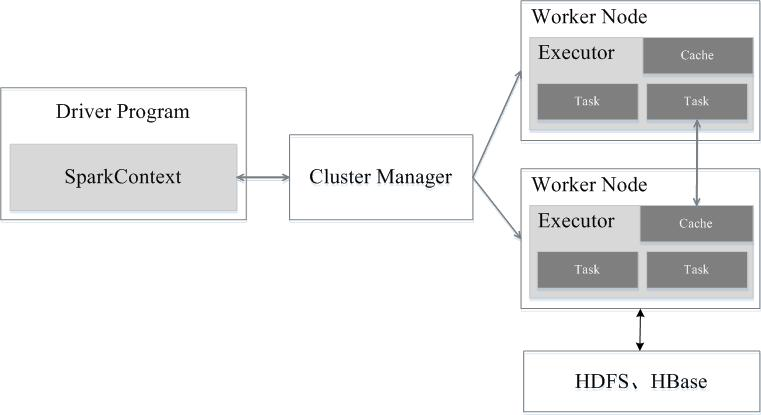

# spark基础

## 1、spark和Hadoop

|              | Hadoop                                    | spark                                                      |
| ------------ | ----------------------------------------- | ---------------------------------------------------------- |
| 类型         | 基础平台，包含计算、存储、调度            | 纯计算工具（分布式）                                       |
| 场景         | 海量数据批处理（磁盘迭代计算）            | 海量数据批处理（内存迭代计算、交互式计算），海量数据流计算 |
| 价格         | 对机器要求低，便宜                        | 对内存有要求，相对较贵                                     |
| 编程范式     | Map+Reduce，API较为底层，算法适应性差     | RDD组成DAG有向无环图，API较为顶层，方便使用                |
| 数据存储结构 | MapReduce中间计算结果在HDFS磁盘上，延迟大 | RDD中间运算结果在内存中，延迟小                            |
| 运行方式     | Task以进程方式维护，任务启动慢            | Task以线程方式维护，任务启动快，可批量创建提高并行能力     |

尽管spark相对于Hadoop而言具有较大优势，但spark并不能完全替代Hadoop

- 在计算层面，spark相比较MR有巨大的性能优势，但至今仍有很多计算工具基于MR架构，比如非常成熟的hive。

- spark仅做计算，而Hadoop生态圈不仅有计算（MR），也有存储（HDFS）和资源管理调度（yarn），HDFS和YARN是许多大数据体系的核心架构。

## 2、spark框架模块

整个spark框架模块包含：spark core、spark sql、spark streaming、spark graphX、spark MLlib，而后四项能力都是建立在核心引擎之上的。

spark core：spark的核心，核心功能均由该模块提供。以RDD为数据抽象，提供python、Java、Scala、R语言API，可以编程进行海量离线数据批处理计算。

spark sql： 基于spark core之上，提供结构化数据的处理模块，spark SQL支持以SQL语言对数据进行处理，spark SQL本身针对离线计算场景。同时，基于spark SQL提供了StructuredStreaming模块，可以以spark SQL为基础，进行数据的流式计算。

spark Streaming：以spark core为基础，提供数据的流式计算功能。

MLlib：以spark core为基础，进行机器学习计算，内置了大量的机器学习库和API算法等，方便用户以分布式计算的模式进行机器学习计算。

GraphX：以spark core为基础，进行图计算，提供了大量的图计算API，方便用于以分布式计算模式进行图计算。

## 3、spark运行模式

Spark提供多种运行模式，包括：

- 本地模式(单机)

本地模式就是以一个独立的进程，通过其内部的多个线程来模拟整个Spark运行时环境（**local模式的运行原理**）

- StandAlone模式(集群)

Spark中的各个角色以独立进程的形式存在，并组成Spark集群环境

​		Master角色：Master进程

​		Worker角色：Worker进程

​		Driver角色：以线程运行在master中

​		Executor角色：以线程运行在worker中

- Hadoop YARN模式(集群)

Spark中的各个角色运行在YARN的容器内部，并组成Spark集群环境

- Kubernetes模式(容器集群)

Spark中的各个角色运行在Kubernetes的容器内部，并组成Spark集群环境

- 云服务模式(运行在云平台上)

## 4、spark架构角色

Spark运行架构包括：

Cluster Manager：集群资源管理器

Worker Node：运行作业任务的工作节点

Driver：每个应用的任务控制节点

Executor：每个工作节点上负责具体任务的执行进程

其中，集群资源管理器可以是Spark自带的资源管理器，也可以是YARN或Mesos等资源管理框架。

在Spark中，一个应用（Application）由一个任务控制节点（Driver）和若干个作业（Job）构成，一个作业由多个阶段（Stage）构成，一个阶段由多个任务（Task）组成。当执行一个应用时，任务控制节点会向集群管理器（Cluster Manager）申请资源，启动Executor，并向Executor发送应用程序代码和文件，然后在Executor上执行任务，运行结束后，执行结果会返回给任务控制节点，或者写到HDFS或者其他数据库中。

具体流程步骤如下：

1、Driver在任务提交的本地机器上运行，Driver启动后会和ResourceManager通讯申请启动ApplicationMaster;

2、随后ResourceManager分配Container，在合适的Node Manager上启动Application Master，此时的Application Master的功能相当于一个ExecutorLaucher，只负责向ResourceManager申请Executor内存；

3、ResourceManager接到Application Master的资源申请后会分配Container，然后Application Master在资源分配制定的NodeManager上启动Executor进程；

4、Executor进程启动后会向Driver反向注册，Executor全部注册完成后Driver开始执行main函数；

5、之后执行到Action算子时，触发一个job，并根据宽依赖开始划分stage，每个stage生成对应的TaskSet，之后将task分发到各个Executor上执行。

## 5、spark on YARN

**本质：**

Master角色由YARN的ResourceManager担任

Worker角色由YARN的NodeManager担任

Driver角色运行在YARN容器内或提交任务的客户端进程中

真正干活的Executor运行在YARN提供的容器内

**部署模式：**

spark on yarn 有两种部署模式：Cluster模式和Client模式，区别就是Driver运行的位置。

Cluster模式：Driver运行在YARN容器内部，和Application Master在同一个容器内

Client模式：Driver运行在客户端进程中，比如Driver运行在spark- submit程序的进程中

|                | Cluster模式(生产环境使用)    | Client模式(学习测试使用)                 |
| -------------- | ---------------------------- | ---------------------------------------- |
| Driver运行位置 | YARN容器内                   | 客户端进程内                             |
| 通讯效率       | 高                           | 低于cluster模式                          |
| 日志查看       | 日志输出在容器内，查看不方便 | 日志输出在客户端的标准输出流中，方便查看 |
| 生产可用       | 推荐                         | 不推荐                                   |
| 稳定性         | 稳定                         | 基于客户端进程，受到客户端进程影响       |

## 6、框架和类库

类库：一堆别人写好的代码，你可以导入进行使用。Pandas就是python的类库(PySpark类库)。

框架：可以独立运行并提供编程结构的一种软件产品。spark就是独立的框架(bin/pyspark应用程序)。

pandas用于小规模数据集的处理；spark用于大规模数据集的处理。

| 功能               | PySpark                | spark                      |
| ------------------ | ---------------------- | -------------------------- |
| 底层语言           | python                 | Scala（JVM）               |
| 上层语言支持       | python                 | python/java/scala/R        |
| 集群化/分布式运行  | 不支持，仅支持单机     | 支持                       |
| 定位               | python库（客户端）     | 标准架构（客户端和服务端） |
| 是否可以Daemon运行 | No                     | Yes                        |
| 使用场景           | 本地开发调试python程序 | 生产环境集群化运行         |

## 7、spark应用提交

将程序代码上传到服务器上，通过spark-submit客户端工具进行提交。

1、在代码中不要设置master，如果设置，以代码为准，spark-submit工具的设置就无效了；

2、提交程序到集群中的时候，读取的文件一定是各个机器都能访问到的地址，比如HDFS；

## 8、spark集群角色回顾

当spark Application运行在集群上时，主要有四个部分组成。

Driver负责总体的调度，Executor负责具体Task的运行，它们都是运行在JVM进程之中的，而这些JVM进程则是可以部署在多种的资源管理系统中的，比如Yarn、Mesos或者是K8s等；

用户提交的Spark程序交给Driver进行管理，Driver将程序分解为一个个的Task交给Executor执行。

为了不影响现有Spark的工作架构，Spark在外围包装了一层Python的API，借助Py4j实现Python和Java的交互，进而实现通过Python代码来编写Spark应用程序并提交给Spark集群运行。

上图中白色块为新增的Python进程：

- 在Driver端，Python通过Py4j来调用Java方法，将用户使用Python写的程序映射到JVM中，比如，用户在PySpark中实例化一个Python的SparkContext对象，最终会在JVM中实例化Scala的SparkContext对象。
- 在Executor端，都启动一个Python守护进程，当Task收到任务请求后，交给底层的Python进程去执行

所以，Pyspark的运行机制和我们预想的并不一样，这种方式可以不破坏现有的Spark执行架构，同时也方便多种语言支持的扩展，但是也很明显，使用PySpark运行Spark任务肯定比使用Java或者Scala要有一些额外的性能损耗。

