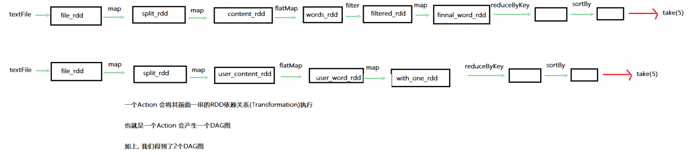
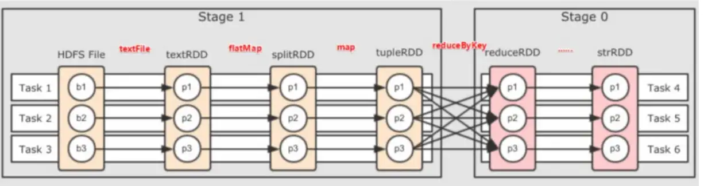
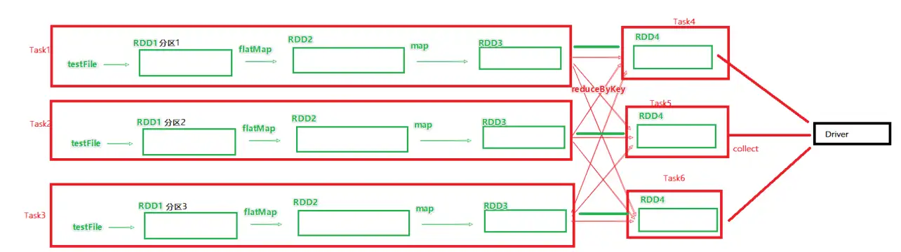
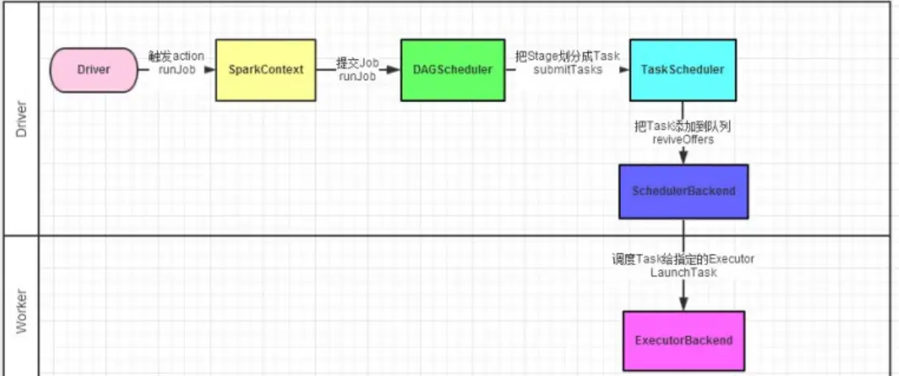

# 内核调度

## 1、DAG

有向无环图，以action结束，作用是标识代码的逻辑执行流程。

Action 算子是个触发开关，会将行动算子之前的一串rdd依赖链条执行起来起来，一个行动算子产生一个DAG。

一个action会产生一个DAG，会在程序运行中产生一个job，所以一个action=一个DAG=一个job。一个代码运行起来，在spark中被称为“ application ”

**层级关系：**一个application中可以有多个job，每个job都有一个DAG，同时每个job都是由一个action产生。

## 2、DAG的宽窄依赖和阶段划分

宽依赖和窄依赖：

窄依赖：父RDD的一个分区，全部将数据发送子RDD的一个分区

宽依赖：父RDD的一个分区，将数据发送给子RDD的多个分区【shuffle】

阶段划分

对于spark来说，会根据DAG，按照宽依赖，划分不同的DAG阶段，

从后往前遇，到一个宽依赖就划分一个阶段，称为stage，

所以在**stage内部一定全是窄依赖**。

阶段1有3个独立的**内存计算管道**，由3个线程并行工作。

## 3、内存迭代计算

基于带分区的DAG，可以从图中得到逻辑最优的task分配，一个task是一个线程来具体执行。

task1中从rdd1->rdd2->rdd3的迭代计算是由一个task来完成，这一阶段的一条直线是纯内存计算。

task1,task2,task3就形成三个并行的内存计算管道。

spark默认收到全局并行度的限制，如果全局并行度是3，那么大部分算子分区都是3.

**面试题1:spark是怎么做内存计算的？DAG的作用？stage阶段划分的作用？**

1. spark会产生DAG图
2. DAG图会基于分区和宽窄依赖划分阶段
3. 一个阶段内部都是窄依赖，窄依赖内，如果形成前后1:1的分区对应关系，就可以产生许多内存迭代计算的管道（如果不是1:1怎么办？）
4. 这些内存迭代计算的管道，就是一个个具体的执行task
5. 一个task是一个具体的线程，任务跑在一个线程内，就是走内存计算了

**面试题2:spark为什么比MapReduce快？**

1. spark算子丰富，MapReduce算子匮乏，很难在一套MR中处理复杂的任务。很多的复杂任务，需要写多个MapReduce进行串联，多个MR串联通过磁盘交互数据。
2. spark可以执行内存迭代，算子之间形成DAG，基于依赖划分阶段后，在阶段内形成内存迭代管道，但是MapReduce的Map和Reduce之间的交互依旧是通过硬盘来交互的。

总结：1、编程模型上spark占优，因为算子够多；2、算子交互上和计算上可以尽量多的内存计算而非磁盘迭代；

## 4、spark并行度

spark的并行：在同一时间内，有多少个task在同时运行。

并行度：并行能力的设置，比如设置并行度6，就是要6个task并行在跑。

在有了6个task并行的前提下，rdd的分区就被规划成6个分区了。

#### 全局并行度：

配置文件中：

conf/spark-defaults.conf中设置 spark.default.parallelism 100

在客户端提交参数中：

bin/spark-submit --conf "spark.default.parallelism=100"

在代码中设置：

conf = SparkConf()

conf.set("spark.default.parallelism", "100")

**全局并行度是推荐设置，不要针对RDD改分区，可能会影响内存迭代管道的构建，或者会产生额外的shuffle。**

#### 针对RDD的并行度设置-不推荐

只能在代码中写，算子：

- repartition算子
- coalesce算子
- partitionBy算子

#### 集群中如何规划并行度

结论：设置为CPU总核心的2-10倍

**为什么要设置最少2倍？**

CPU的一个核心同一时间只能干一件事情。所以在100个核心的情况下，设置100个并行，就能让cpu100%出力。这种设置下，如果task的压力不均衡，某个task先执行完了，就导致某个CPU核心空闲。

所以，我们将task(并行)分配的数量变多，比如800个并行，同一时间只有100个在运行，700个在等待。但是可以确保，某个task运行完成，后续有task补上，不让CPU闲下来，最大程度利用集群的资源。

为什么要**整数**倍？极端情况下，每一批次都是同时完成，整数倍能够100利用CPU。

## 5、spark的任务调度

spark的任务，由driver进行调度，这个工作包含：

1. 逻辑DAG产生
2. 分区DAG产生
3. task划分
4. 将task分配给executor并监控其工作

如图，spark程序调度流程：

1、Dirver被构建出来

2、构建SparkContext【执行环境入口对象】

3、基于**DAG调度器**构建逻辑Task分配

4、基于**Task调度器**将逻辑Task分配到各个Executor上工作，并监控它们

5、worker（executor）被task调度器管理监控，听从指令工作，并定期汇报进度

1、2、3、4都是driver的工作，5是worker的工作

#### driver内的两个组件：

DAG调度器：将逻辑的DAG图进行处理，最终得到逻辑上的task划分

task调度器：基于DAG Scheduler(DAG调度器)的产出，来规划这些逻辑的task，应该在哪些物理的executor上运行，以及监控它们的运行。

## 6、拓展

层级关系梳理：

1. 一个spark环境可以运行多个application；
2. 一个代码运行起来，会成为一个application；
3. application内部可以有多个job；
4. 每个job由一个action(简单理解就是action算子)产生，并且每个job有自己的DAG执行图；
5. 一个job的DAG图会基于宽窄依赖划分成不同的阶段(stage)；
6. 不同阶段内基于分区数量，形成多个并行的内存迭代管道；
7. 每一个内存迭代管道形成一个task(DAG调度器划分将job划分出具体的task任务，一个job被划分出来的task在逻辑上称之为这个job的task set)

一个application里可以触发多次action ,触发一次action形成一个job， 一个job对应一个DAG,

一个DAG可以根据shuffle切分成多个stage,一个stage里可以有多个taskset 一个taskset中可以有多个task（计算逻辑相同的task，只是处理的数据不一样）。

## 总结：

- DAG是什么？有什么用？

DAG是有向无环图，用以描述任务执行流程，主要作用是协助DAG调度器构建task分配用以做任务管理

- 内存迭代/阶段划分？

基于DAG的宽窄依赖划分阶段，阶段内部都是窄依赖，可以构建内存迭代的管道

- DAG调度器是？

构建task分配用以做任务管理
