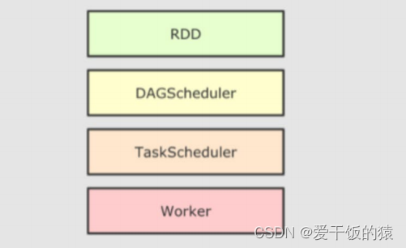
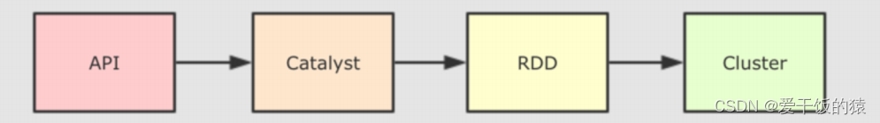
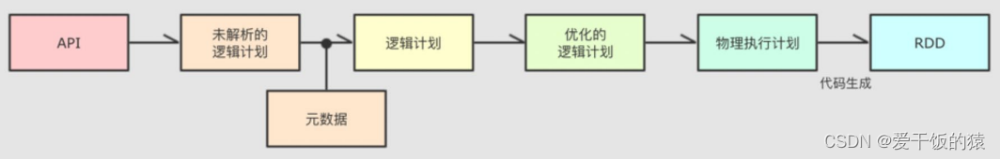
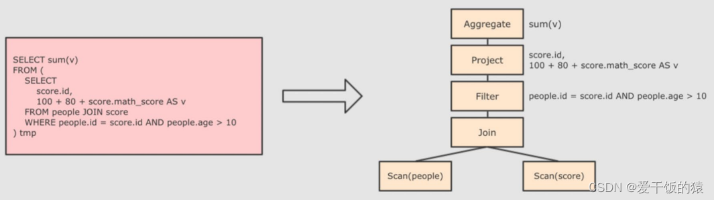
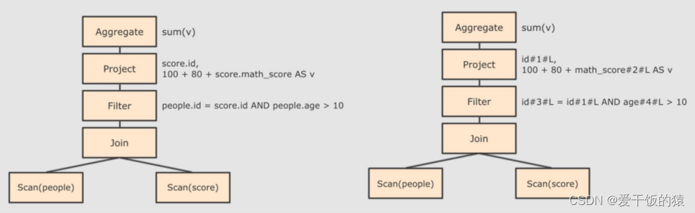
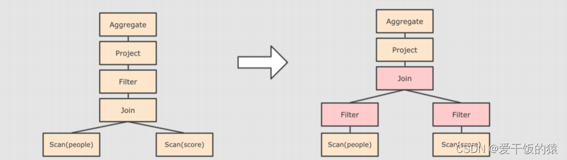
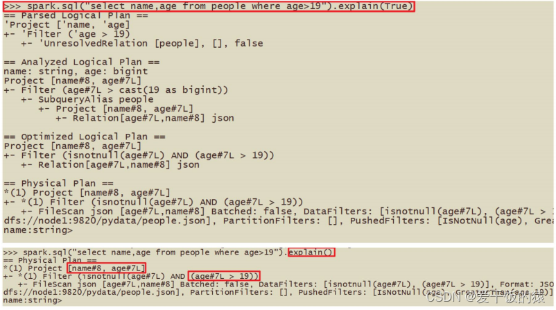
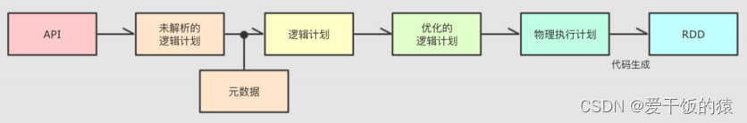

# SparkSQL的运行流程

## 1、SparkRDD的执行流程回顾

代码->DAG调度器逻辑任务->Task调度器任务分配和管理监控-> Worker干活

## 2、SparkSQL的自动优化

RDD的运行会完全按照开发者的代码执行， 如果开发者水平有限，RDD的执行效率也会受到影响。

而SparkSQL会对写完的代码，执行“自动优化”， 以提升代码运行效率，避免开发者水平影响到代码执行效率。

问：为什么SparkSQL可以自动优化而RDD不可以？

RDD：内含数据类型不限格式和结构
DataFrame：100% 是二维表结构，可以被针对。

SparkSQL的自动优化，依赖于：Catalyst优化器

## 3 Catalyst优化器

为了解决过多依赖[Hive](https://so.csdn.net/so/search?q=Hive&spm=1001.2101.3001.7020) 的问题, SparkSQL使用了一个新的SQL优化器替代 Hive 中的优化器,这个优化器就是Catalyst,整个SparkSQL的架构大致如下:

1. API层简单的说就是Spark会通过一些API接受SQL语句
2. 收到SQL语句以后,将其交给Catalyst, Catalyst负责解析SQL,生成执行计划等
3. Catalyst的输出应该是RDD的执行计划
4. 最终交由集群运行

具体流程：

step1：解析SQL,并且生成AST(抽象语法树)

Step 2:在AST中加入元数据信息做这一步主要是为了一些优化。例如 col = col这样的条件，下图是一个简略图,便于理解

- score.id →id#1#L为score.id生成id为1,类型是Long

- score.math_score → math_score#2#L为score.math_score 生成id为2,类型为Long

- people.id → id#3#L为people.id生成 id为3,类型为Long

- people.age →age#4#L为people.age 生成 id为4,类型为Long

Step 3:对已经加入元数据的AST,输入优化器,进行优化,从两种常见的优化开始，简单介绍:

- 断言下推 Predicate Pushdown,将Filter这种可以减小数据集的操作下推,放在Scan 的位置,这样可以减少操作时候的数据量。断言下推后，会先过滤age,然后在JOIN,减少JOIN的数据量提高性能.

- 列值裁剪Column Pruning,在断言下推后执行裁剪,由于people表之上的操作只用到了 id 列,所以可以把其它列裁剪掉,这样可以减少处理的数据量,从而优化处理速度

Step 4:上面的过程生成的AST其实最终还没办法直接运行,这个AST叫做逻辑计划,结束后，需要生成.物理计划,从而生成RDD来运行

- 在生成物理计划的时候,会经过成本模型对整棵树再次执行优化,选择一个更好的计划

- 在生成物理计划以后,因为考虑到性能,所以会使用代码生成,在机器中运行

可以使用queryExecution方法查看逻辑执行计划,使用explain方法查看物理执行计划：

小结：

catalyst的各种优化细节非常多,大方面的优化点有2个:

谓词下推(Predicate Pushdown)\断言下推:将逻辑判断提前到前面,以减少shuffle阶段的数据量

列值裁剪(Column Pruning):将加载的列进行裁剪,尽量减少被处理数据的|宽度

大白话:

行过滤,提前执行where

列过滤,提前规划select的字段数量

思考:列值裁剪,有一种非常合适的存储系统: parquet

## 4 SparkSQL的执行流程

1、提交SparkSQL代码
2、catalyst优化
a. 生成原始AST语法数
b.标记AST元数据
c.进行断言下推和列值裁剪以及其它方面的优化作用在AST上
d.将最终AST得到,生成执行计划
e.将执行计划翻译为RDD代码
3、Driver执行环境入口构建(SparkSession)
4、DAG调度器规划逻辑任务
5、TASK调度区分配逻辑任务到具体Executor上工作并监控管理任务
6、Worker干活.

### 5 总结

1. DataFrame因为存储的是二维表数据结构，可以被针对，所以可以
   自动优化执行流程。
2. 自动优化依赖Catalyst优化器
3. 自动优化2个大的优化项是：1. 断言（谓词）下推（行过滤） 2. 列
   值裁剪（列过滤）
4. DataFrame代码在被优化有，最终还是被转换成RDD去执行