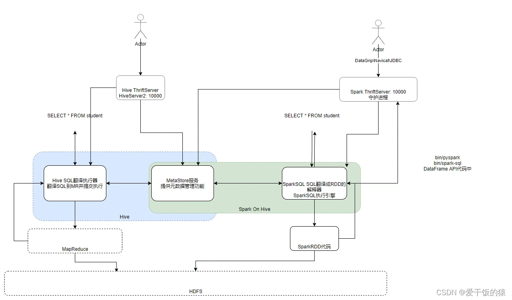

## 分布式SQL执行引擎

### 1 概念

Spark中有一个服务叫做: ThriftServer服务,可以启动并监听在10000端口
这个服务对外提供功能,我们可以用数据库工具或者代码连接上来直接写SQL即可操作spark

当使用ThriftServer后，相当于是一个持续性的Spark On Hive集成模式．它提供10000端口，持续对外提供服务,外部可以通过这个端口连接上来, 写SQL, 让Spark运行

总结
分布式SQL执行引擎就是使用Spark提供的ThriftServer服务，以“后台进程”的模式持续运行，对外提供端口。

可以通过客户端工具或者代码，以JDBC协议连接使用。

SQL提交后，底层运行的就是Spark任务。相当于构建了一个以MetaStore服务为元数据，Spark为执行引擎的数据库服务，像操作数据库那样方便的操作SparkSQL进行分布式的SQL计算。
