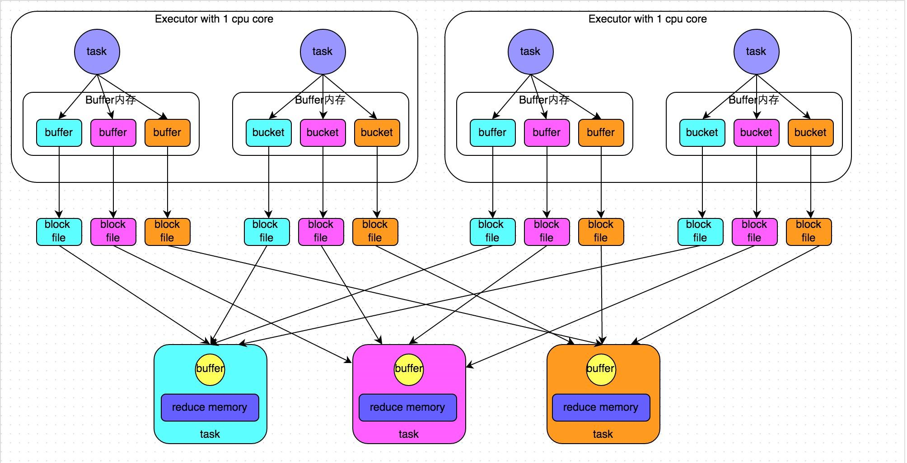
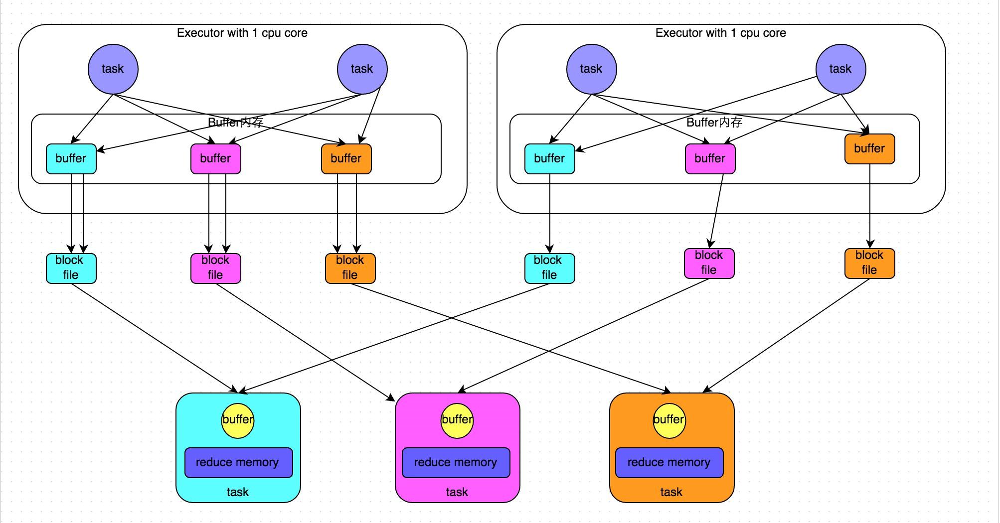
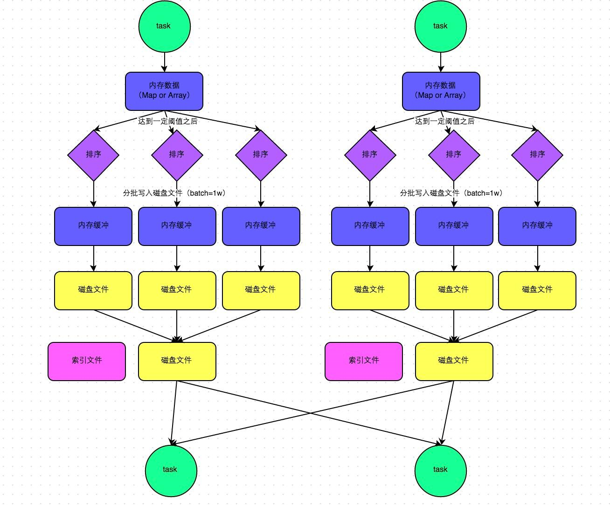
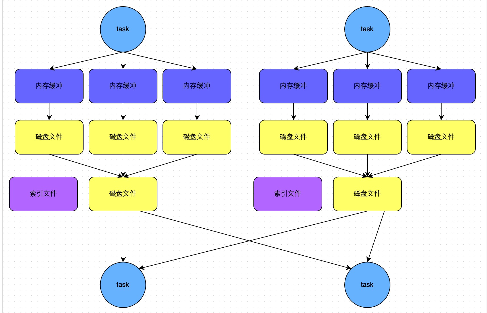
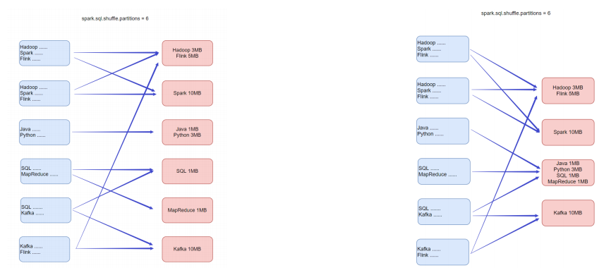
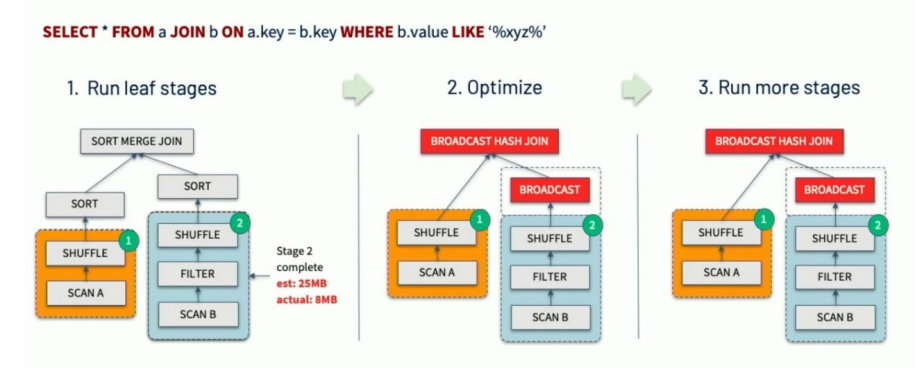
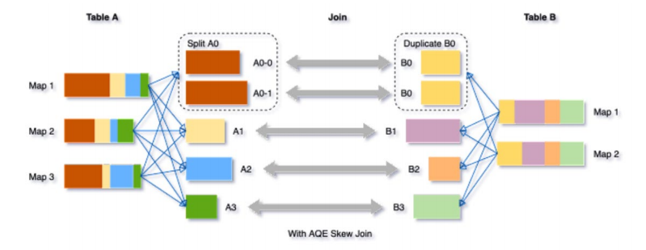
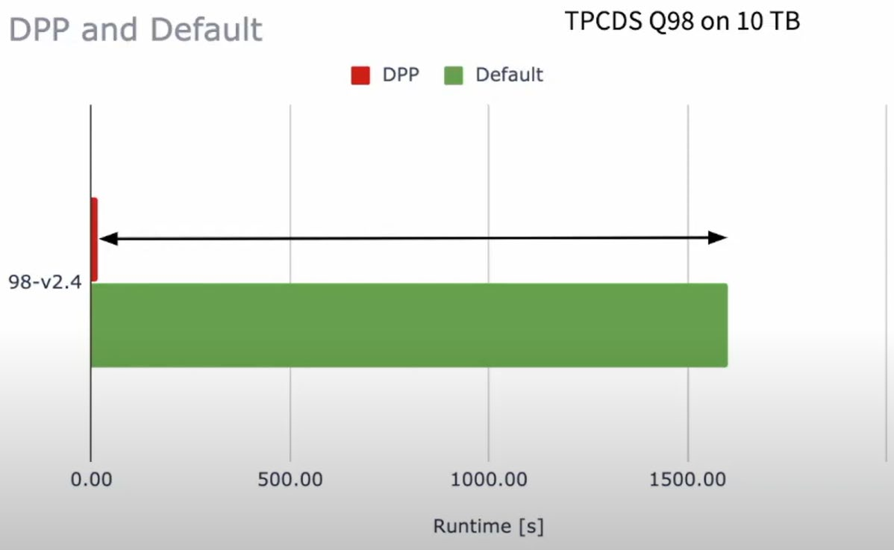
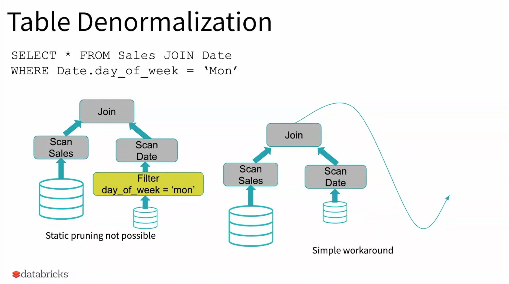
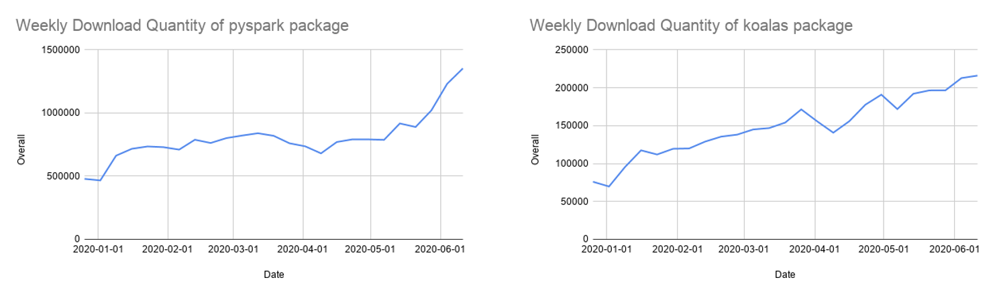

## 1、spark的shuffle流程

https://cloud.tencent.com/developer/article/1336602

### map和reduce

在shuffle过程中，提供数据的称之为map端(shuffle write)，接收数据的称之为reduce端(shuffle read)。

在spark两个阶段中，总是前一个阶段产生一批map提供数据，下一个阶段产生一批reduce接收数据。


### HashShuffleManager:

普通的HashShuffle:



优化的HashShuffle:



基本和未优化的一致，不同点在于：

1. 在一个executor内，不同task共享buffer缓冲区；
2. 这样减少了缓冲区乃至写入磁盘文件的数量，提高性能；


### SortShuffleManager:

spark1.2推出新的shuffleliu cheng：SortShuffle

SortShuffleManager运行机制主要分两种，一种是普通运行机制，另一种是bypass运行机制。

普通的SortShuffle：



 SortShuffle的bypass机制：



有条件的sort，当shuffle reduce task数量小于`spark.shuffle.sort.bypassMergeThreshold`参数的值（默认200）时，会触发bypass机制，不进行sort，假如目前有300个reduce task，如果要触发bypass机制，就就设置spark.shuffle.sort.bypassMergeThreshold的值大于300，bypass机制最终产生2*m（map task的数量）的小文件。

总结：

1、SortShuffle对比HashShuffle可以减少很多的磁盘文件，以节省网络IO开销；

2、SortShuffle主要是对磁盘文件进行合并来进行文件数量的减少，同时同类shuffle都需要经过内存缓冲区溢写磁盘的场景，所以可以得知，尽管spark是内存迭代计算框架，但是内存迭代主要在窄依赖中，在宽依赖(shuffle)中磁盘交互还是一个无可避免的情况。所以，我们要尽量减少shuffle的出现，不要进行无意义的shuffle计算。

## 2、spark3.0新特性

http://go.itcast.cn/news/20230322/14504116291.shtml

### 1.Adaptive Query Execution 自适应查询(SparkSQL)

开启AQE方式：

```python
set spark.sql.adaptive.enabled = true;
```

由于缺乏或者不准确的数据统计信息(元数据)和对成本的错误估算(执行计划调度)导致生成的初始执行计划不理想，在Spark3.x版本提供Adaptive Query Execution自适应查询技术。

通过在”运行时”对查询执行计划进行优化，允许Planner在运行时执行可选计划，这些可选计划将会基于运行时数据统计进行动态优化，从而提高性能。

Adaptive Query Execution AQE主要提供了三个自适应优化:

• 动态合并 Shuffle Partitions

• 动态调整Join策略

• 动态优化倾斜Join(Skew Joins)

#### **动态合并 Dynamically coalescing shuffle partitions**

可以动态调整shuffle分区的数量。用户可以在开始时设置相对较多的shuffle分区数，AQE会在运行时将相邻的小分区合并为较大的分区。



#### **动态调整Join策略 Dynamically switching join strategies**

此优化可以在一定程度上避免由于缺少统计信息或着错误估计大小(当然也可能两种情况同时存在)，而导致执行计划性能不佳的情况。这种自适应优化可以在运行时sort merge join转换成broadcast hash join，从而进一步提升性能。



#### **动态优化倾斜Join**

skew joins可能导致负载的极端不平衡，并严重降低性能。在AQE从shuffle文件统计信息中检测到任何倾斜后，它可以将倾斜的分区分割成更小的分区，并将它们与另一侧的相应分区连接起来。这种优化可以并行化倾斜处理，获得更好的整体性能。



触发条件:

分区大小 > spark.sql.adaptive.skewJoin.skewedPartitionFactor (default=10) * "median partition size(中位数分区大小)"

分区大小 > spark.sql.adaptive.skewJoin.skewedPartitionThresholdInBytes (default = 256MB)

总结:

（1） AQE的开启通过: spark.sql.adaptive.enabled 设置为true开启。

（2） AQE是自动化优化机制, 无需我们设置复杂的参数调整, 开启AQE符合条件即可自动化应用AQE优化。

（3） AQE带来了极大的SparkSQL性能提升。

### **2.Dynamic Partition Pruning 动态分区裁剪(SparkSQL)**

当优化器在编译时无法识别可跳过的分区时，可以使用"动态分区裁剪"，即基于运行时推断的信息来进一步进行分区裁剪。这在星型模型中很常见，星型模型是由一个或多个并且引用了任意数量的维度表的事实表组成。在这种连接操作中，我们可以通过识别维度表过滤之后的分区来裁剪从事实表中读取的分区。在一个TPC-DS基准测试中，102个查询中有60个查询获得2到18倍的速度提升。





### **3. 增强的Python API: PySpark和Koalas**

Python现在是Spark中使用较为广泛的编程语言，因此也是Spark 3.0的重点关注领域。Databricks有68%的notebook命令是用Python写的。PySpark在Python Package Index上的月下载量超过500 万。

很多Python开发人员在数据结构和数据分析方面使用pandas API，但仅限于单节点处理。Databricks会持续开发Koalas——基于Apache Spark的pandas API实现，让数据科学家能够在分布式环境中更高效地处理大数据。

经过一年多的开发，Koalas实现对pandas API将近80%的覆盖率。Koalas每月PyPI下载量已迅速增长到85万，并以每两周一次的发布节奏快速演进。虽然Koalas可能是从单节点pandas代码迁移的最简单方法，但很多人仍在使用PySpark API，也意味着 PySpark API也越来越受欢迎。



新版Koalas类库可以让我们写Pandas API(Koalas提供)然后将它们运行在分布式的Spark环境上, Pandas开发者也能快速上手Spark。


