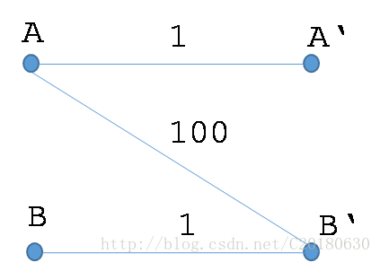
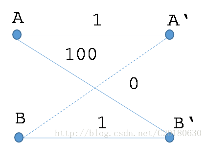

https://www.cnblogs.com/fzl194/p/8848061.html

## 最佳匹配

### 什么是完美匹配

如果一个二分图，X部和Y部的顶点数相等，若存在一个匹配包含X部与Y部的所有顶点，则称为完美匹配。 
换句话说：若二分图X部的每一个顶点都与Y中的一个顶点匹配，**并且**Y部中的每一个顶点也与X部中的一个顶点匹配，则该匹配为完美匹配。

### 什么是完备匹配

如果一个二分图，X部中的每一个顶点都与Y部中的一个顶点匹配，**或者**Y部中的每一个顶点也与X部中的一个顶点匹配，则该匹配为完备匹配。

### 什么是最佳匹配

**带权**二分图的**权值最大**的**完备匹配**称为最佳匹配。

二分图的最佳匹配不一定是二分图的最大权匹配。 

#### 转化

可以添加一些权值为0的边，使得最佳匹配和最大权匹配统一起来。 

## KM算法

求二分图的最佳匹配有一个非常优秀的算法,可以做到O(N^3),这就是KM算法。该算法描述如下：

1.首先选择顶点数较少的为X部，初始时对X部的每一个顶点设置顶标，顶标的值为该点关联的最大边的权值，Y部的顶点顶标为0。

2.对于X部中的每个顶点，在相等子图中利用匈牙利算法找一条增广路径，如果没有找到，则修改顶标，扩大相等子图，继续找增广路径。当每个点都找到增广路径时，此时意味着每个点都在匹配中，即找到了二分图的完备匹配。该完备匹配即为二分图的最佳匹配。

什么是相等子图呢？因为每个顶点有一个顶标，如果我们选择边权等于两端点的顶标之和的边，它们组成的图称为相等子图。

如果从X部中的某个点Xi出发在相等子图中没有找到增广路径，我们是如何修改顶标的呢？如果我们没有找到增广路径，则我们一定找到了许多条从Xi出发并结束于X部的匹配边与未匹配边交替出现的路径，姑且称之为交错树。我们将交错树中X部的顶点顶标减去一个值d，交错树中属于Y部的顶点顶标加上一个值d。这个值后面要讲它如何计算。那么我们会发现：

- 两端都在交错树中的边(i,j)，其顶标和没有变化。也就是说，它原来属于相等子图，现在仍属于相等子图。
- 两端都不在交错树中的边(i,j)，其顶标也没有变化。也就是说，它原来属于（或不属于）相等子图，现在仍属于（或不属于）相等子图。
- X端不在交错树中，Y端在交错树中的边(i,j)，它的顶标和会增大。它原来不属于相等子图，现在仍不属于相等子图。
- X端在交错树中，Y端不在交错树中的边(i,j),它的顶标和会减小。也就说，它原来不属于相等子图，现在可能进入了相等子图，因而使相等子图得到了扩大。
- 我们修改顶标的目的就是要扩大相等子图。为了保证至少有一条边进入相等子图，我们可以在交错树的边中寻找顶标和与边权之差最小的边,这就是前面说的d值。将交错树中属于X部的顶点减去d，交错树中属于Y部的顶点加上d。则可以保证至少有一条边扩充进入相等子图。

3.当X部的所有顶点都找到了增广路径后，则找到了完备匹配，此完备匹配即为最佳匹配。

## 相等子图的若干性质

1. 1. 在任意时刻，相等子图上的最大权匹配一定小于等于相等子图的顶标和。
   2. 在任意时刻，相等子图的顶标和即为所有顶点的顶标和。
   3. 扩充相等子图后，相等子图的顶标和将会减小。
   4. 当相等子图的最大匹配为原图的完备匹配时，匹配边的权值和等于所有顶点的顶标和，此匹配即为最佳匹配