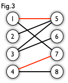

https://blog.csdn.net/pi9nc/article/details/11848327?utm_medium=social&utm_source=qq

# 二分图的最大匹配、完美匹配和匈牙利算法

**二分图**：简单来说，如果图中点可以被分为两组，并且使得所有边都跨越组的边界，则这就是一个二分图。准确地说：把一个图的顶点划分为两个不相交集合 ，使得每一条边都分别连接 、  中的顶点。如果存在这样的划分，则此图为一个二分图。二分图的一个等价定义是：不含有「含奇数条边的环」的图。图 1 是一个二分图。为了清晰，我们以后都把它画成图 2 的形式。

**匹配**：在图论中，一个「匹配」（matching）是一个边的集合，其中任意两条边都没有公共顶点。例如，图 3、图 4 中红色的边就是图 2 的匹配。

   

我们定义**匹配点**、**匹配边**、**未匹配点**、**非匹配边**，它们的含义非常显然。例如图 3 中 1、4、5、7 为匹配点，其他顶点为未匹配点；1-5、4-7为匹配边，其他边为非匹配边。

**最大匹配**：一个图所有匹配中，所含匹配边数最多的匹配，称为这个图的最大匹配。图 4 是一个最大匹配，它包含 4 条匹配边。

**完美匹配**：如果一个图的某个匹配中，所有的顶点都是匹配点，那么它就是一个完美匹配。图 4 是一个完美匹配。显然，完美匹配一定是最大匹配（完美匹配的任何一个点都已经匹配，添加一条新的匹配边一定会与已有的匹配边冲突）。但并非每个图都存在完美匹配

举例来说：如下图所示，如果在某一对男孩和女孩之间存在相连的边，就意味着他们彼此喜欢。是否可能让所有男孩和女孩两两配对，使得每对儿都互相喜欢呢？图论中，这就是**完美匹配**问题。如果换一个说法：最多有多少互相喜欢的男孩/女孩可以配对儿？这就是**最大匹配**问题。

基本概念讲完了。求解最大匹配问题的一个算法是**匈牙利算法**，下面讲的概念都为这个算法服务。

## **匈牙利算法**

基本概念讲完了。求解最大匹配问题的一个算法是**匈牙利算法**，下面讲的概念都为这个算法服务。

**交替路**：从一个未匹配点出发，依次经过非匹配边、匹配边、非匹配边...形成的路径叫交替路。

**增广路**：从一个未匹配点出发，走交替路，如果途径另一个未匹配点（出发的点不算），则这条交替路称为增广路（agumenting path）。例如，图 5 中的一条增广路如图 6 所示（图中的匹配点均用红色标出）：

增广路有一个重要特点：非匹配边比匹配边多一条。因此，研究增广路的意义是**改进匹配**。只要把增广路中的匹配边和非匹配边的身份交换即可。由于中间的匹配节点不存在其他相连的匹配边，所以这样做不会破坏匹配的性质。交换后，图中的匹配边数目比原来多了 1 条。

增广路径必须满足的性质:

1.有奇数条边。

2.起点在二分图的左半边，终点在右半边。

3.路径上的点一定是一个在左半边，一个在右半边，交替出现。（其实二分图的性质就决定了这一点，因为二分图同一边的点之间没有边相连，不要忘记哦。）

4.整条路径上没有重复的点。

5.**起点和终点都是目前还没有配对的点，而其它所有点都是已经配好对的。**

6.路径上的所有第奇数条边都不在原匹配中，所有第偶数条边都出现在原匹配中。

7.最后，也是最重要的一条，把**增广路径上的所有第奇数条边加入到原匹配中去**，并把增广路径中的所有第偶数条边从原匹配中删除（这个操作称为增广路径的取反），则**新的匹配数就比原匹配数增加了1个（奇数=偶数+1）。**

https://my.oschina.net/u/4010368/blog/4599350

https://www.cnblogs.com/shenben/p/5573788.html

**匈牙利算法：**利用增广路径求二分图的最大匹配算法称作匈牙利算法。（匈牙利数学家Edmonds于1965年提出）。
**基本思想：**通过寻找增广路径，把增广路径中的匹配边和非匹配边的相互交换，这样就会多出一条匹配边，直到找不到增广路径为止。

例如：以图2.1所示的二分图为例，使用匈牙利算法求解图的最大匹配(***深度优先***)。
（1）从顶点a出发，按照交替路径前进，第一个非匹配边为 ，到达顶点e，e为非匹配点，构成增广路径。令 为匹配边，顶点a，e为匹配顶点。 

（2）从顶点b出发，第一非匹配边为 

，到达顶点e，选择匹配边 ，到达a，选择非匹配边 ，g为非匹配点，找到一条增广路径。 

（3）交换增广路径中的匹配边与非匹配边，得到如下匹配。 

（4）从顶点c出发，第一非匹配边为 ，到达顶点e，然后按照交替路径前进，到达顶点b，无法继续前进。 

（5）从顶点c出发，选择第二条非匹配边 。 

（6）从顶点d出发，选择非匹配边 ，到达顶点g，选择匹配边 ，到达顶点a，选择非匹配边到达顶点e，选择匹配边 ，到达顶部b，没有可以选择的边，且没有找到增广路径。 

（7）继续从顶点d出发，选择非匹配边 ，找到增广路径，将边 变为匹配边，算法结束。 

https://zhuanlan.zhihu.com/p/208596378

考虑一个下面这个二分图，怎么找到最大的匹配呢？

图2 待配对的无向图

一个自然的思路是，一个一个的配对。首先给A配对。一看A和a有意向，那就先把他俩撮合到一起。

现在效果就变成这样了。

图3

蓝色的是他们本身有意向的情况，就是原始二分图，要记得蓝线连一块并不叫“匹配边”，而是“非匹配边”。红色的是我们给他们配对了，红线才叫“匹配边”。

好了，A的问题暂时性解决了，轮到B了。结果b也想和a配对。

**这时候，谁才能和a在一起呢？交替路和增广路就是解决这个冲突的。**

这时候，我们要找一条交替路，就是依次经过非匹配边（蓝线）、匹配边（红线）。那么我们从B出发，开始找交替路了。我们找到了

（非匹配边） (匹配边) (非匹配边)

B--------------a----------------A-----------------c

B和c都是没有被匹配过的点，而它又是这条交替路的起点和终点。这条交替路就是增广路。

现在我们要做一个取反操作，怎么取呢，就是将上面这条增广路的匹配边变成不匹配边，不匹配边变成匹配边。

（匹配边） (非匹配边) (匹配边)

B--------------a----------------A-----------------c

还是用红色表示匹配边，蓝色表示非匹配边。画在图上，现在的匹配变成这样。

图4

然后，我们发现，刚刚的冲突问题解决了。由B和a在一起，A和c在一块。

AB的问题都解决了，轮到C了。C要和c配对，又发生冲突了。于是，又要使用增广路来增加一个匹配了。

（非） （匹） （非） （匹） （非）

C--------c-----------A----------a----------B---------b

取个反得到：

（匹） （非） （匹） （非） （匹）

C--------c-----------A----------a----------B---------b

画成图长这样

图5

现在，ABC的配对都解决了。我们找到了最大匹配。由于A\B\C\a\b\c都找到了自己的心仪对象。因此，这个最大匹配也是完美匹配。

**下面这个链接里的二分图，就没能找到完美匹配。**

[匈牙利算法（二分图） - 神犇(shenben) - 博客园www.cnblogs.com/shenben/p/5573788.html](https://link.zhihu.com/?target=https%3A//www.cnblogs.com/shenben/p/5573788.html)

## 匈牙利算法

**上述利用增广路找最大匹配的算法，就叫做匈牙利算法。**

总结一下匈牙利算法：

每个点从另一个集合里挑对象，没冲突的话就先安排上，要是冲突了就用增广路径重新匹配。重复上述思路，直到所有的点都找到对象，或者找不到对象也找不到增广路。

## 深度优先和广度优先

上述是**深度优先匈牙利算法**。就是冲突了立刻用增广路来解决。

另外一种是**广度优先匈牙利算法**。思路是，冲突了就换一个心仪对象，看另一个心仪对象是不是也配对了，要是都配对了，再用增广路来解决。

广度优先的流程是这样的：

（1）**A和a连上。**

（2）B也想连a，但是a被连了，就找下一个心仪对象b。

（3）b没有被连上，**B和b就连在一起**。

（4）轮到C的时候，C找心仪对象c。

（5）c也没被连上，**所以C和c连一起。**