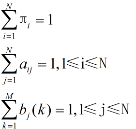

**前向后项算法**：

   step1 初始化： 随机地给定参数 πi, aij, bj(k),使其满足条件：

​            

​            由此得到μ0，令i=0

   step2 EM计算：

​          E步骤：根据（1）（2）式计算期望ξt(i,j) 和 rt(i)

​          M步骤：根据期望ξt(i,j) 和 rt(i),带入（3）（4）（5）重新得到πi, aij, bj(k)，得到μi+1

​    step3 循环计算： i = i+1, 直到πi, aij, bj(k)收敛