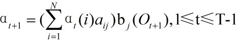
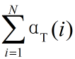
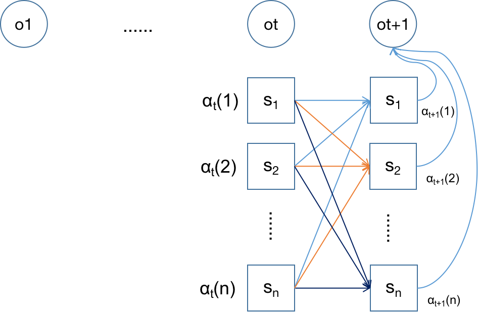

前向算法：https://www.cnblogs.com/kaituorensheng/archive/2012/12/01/2797230.html

前向算法：
$$
\alpha_t(i):在时刻t,HMM输出序列为o_1,o_2...o_t,在第t时刻位于状态s_i的概率 
\\T=1时，输出序列为o_1:\\
\begin{aligned}
p(o_1|\mu)&=\pi_1*b_1(o_1)+\pi_1*b_2(o_1)+\pi_1*b_3(o_1)\\
          &= \alpha_1(1)+\alpha_1(2)+\alpha_1(3)
\end{aligned}
$$

$$
T=2时，输出序列为o_1o_2:\\
P(O_1O_2,q_2=s_1|μ）= (α_1(1)*a_{11} + α_1(2)*a_{21} + α_1(3)*a_{31})*b_1(O_2)=α_2(1)\\
P(O_1O_2,q_2=s_2|μ）= (α_1(1)*a_{12} + α_1(2)*a_{22} + α_1(3)*a_{32})*b_2(O_2)=α_2(2)\\
P(O_1O_2,q_2=s_3|μ）= (α_1(1)*a_{13} + α_1(2)*a_{23} + α_1(3)*a_{33})*b_3(O_2)=α_2(3)\\
\begin{aligned}
所以：P(O_1O_2|μ）&=P(O_1O_2,q_2=s_1|μ）+ P(O_1O_2,q_2=s_2|μ）+ P(O_1O_2,q_2=s_3|μ）\\
               &=α_2(1) + α_2(2) + α_2(3)
\end{aligned}
$$

**前向算法**

​    step1 初始化：α1(i) = πi*bi(O1), 1≤i≤N

​    step2 归纳计算:

​              

​    step3 终结：

​           P(O|μ）=

前向算法图示：

