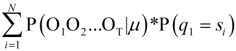

后向算法：https://www.cnblogs.com/kaituorensheng/archive/2012/12/03/2800489.html

​                   https://www.cnblogs.com/sjjsxl/p/6285629.html

**后向变量βt(i)**:给定模型μ=（A,B,π），并且在时间 **时刻t 状态为si** 的前提下，输出序列为Ot+1Ot+2...OT的概率，即：
$$
\beta_t(i)=p(o_{t+1}o_{t+2}...o_T|q_t=s_i,\mu)
$$
当t=T时，按照定义：**时间t** **状态qT** 输出为OT+1......的概率，从T+1开始的输出是不存在的（因为T时刻是终止终止状态），即T之后是空，是个必然事件，因此：βt(i)=1,1≤1≤N
$$
\beta_t(i)=1, 1\le t \le N
$$
*可以理解成，新增一个观测值#end#，该值和**隐藏状态、上一状态无关**，只和t有关*

当t=T-1时，
$$
\beta_{T-1}(i)=p(o_T|q_{T-1}=s_i,\mu)=a_{i1}*b_1(o_T)\beta_T(1)+a_{i2}*b_2(o_T)\beta_T(2)+a_{i3}*b_3(o_T)\beta_T(3)
$$
**当t=1时，**
$$
β_1(1)=P(O_2O_3...O_T|q_2=s_1,μ) = a_{11}*b_1(O_2)*β_2(1) + a_{12}*b_2(O_2)*β_2(2) + a_{13}*b_3(O_2)*β_2(3)\\

β_1(2)=P(O_2O_3...O_T|q_2=s_2,μ) = a_{21}*b_1(O_2)*β_2(1) + a_{22}*b_2(O_2)*β_2(2) + a_{23}*b_3(O_2)*β_2(3)\\

β_1(3)=P(O_2O_3...O_T|q_2=s_3,μ) = a_{31}*b_1(O_2)*β_2(1) + a_{32}*b_2(O_2)*β_2(2) + a_{33}*b_3(O_2)*β_2(3)
$$
​    

P(O1O2...OT|μ) =  

​               =  

​               =  

**后向算法**

  step1 初始化：βT(i)=1, 1≤1≤N

  step2 归纳计算：

​            1≤t≤T-1, 1≤i≤N

  step3 求终结和：

​          P(O|μ）=  \**

