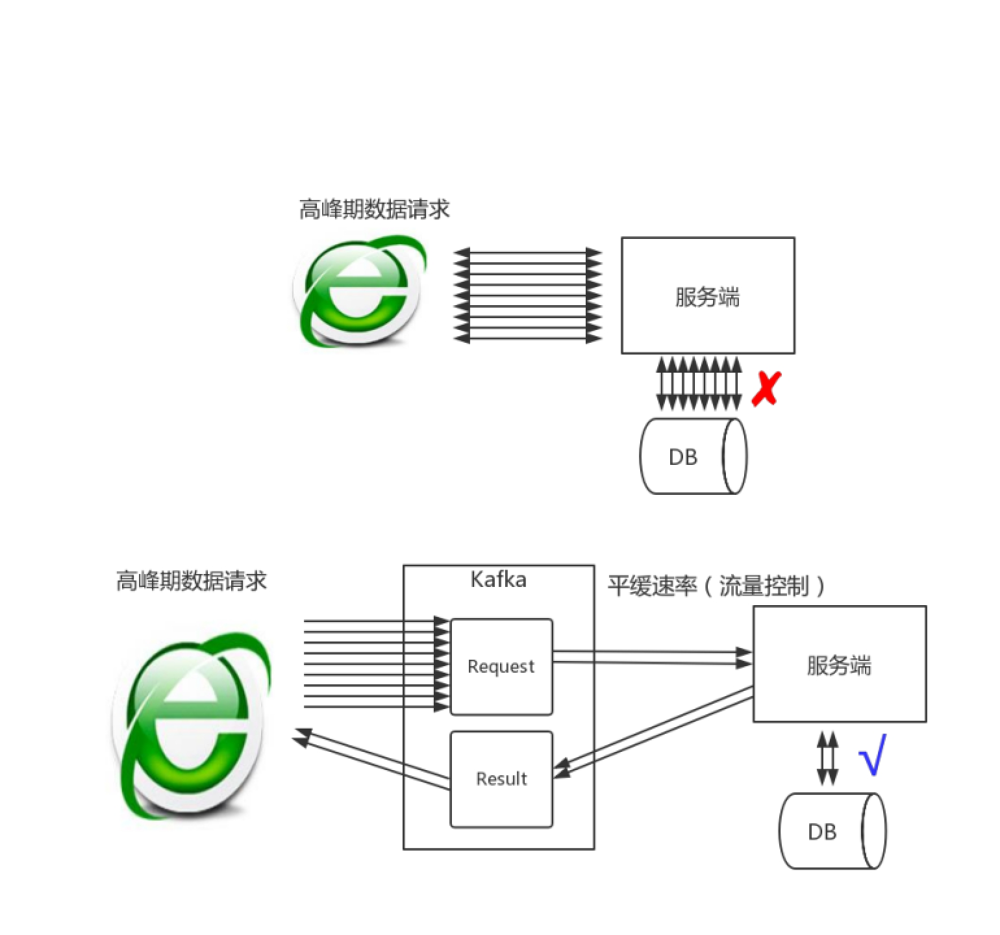
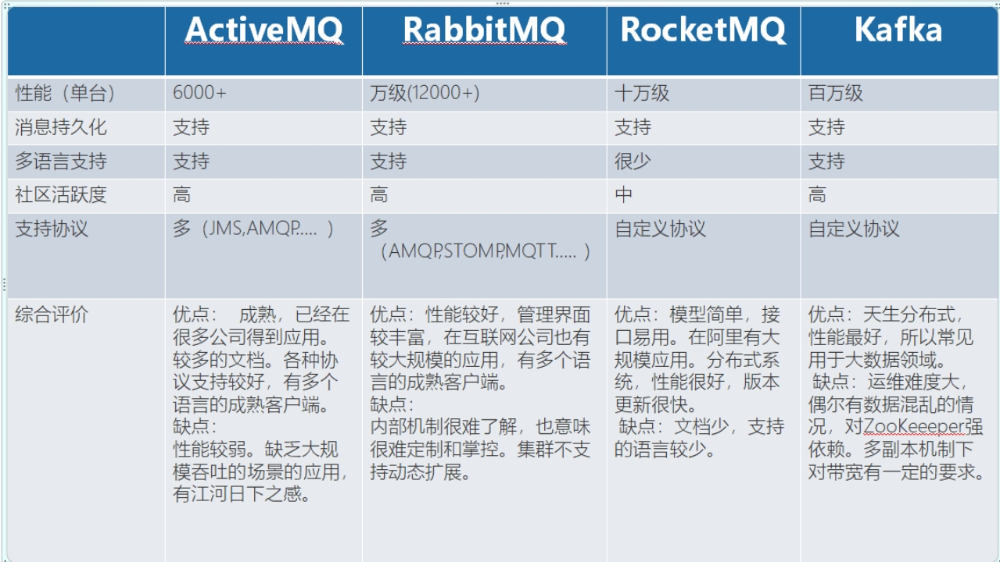
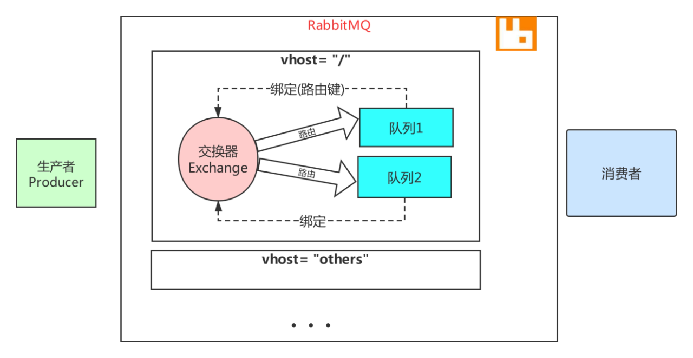
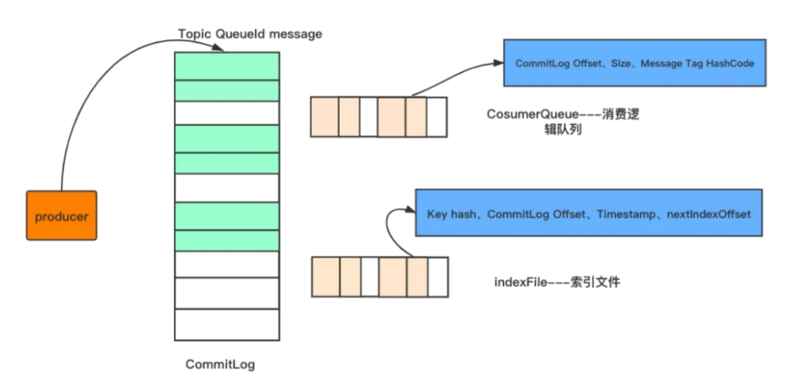
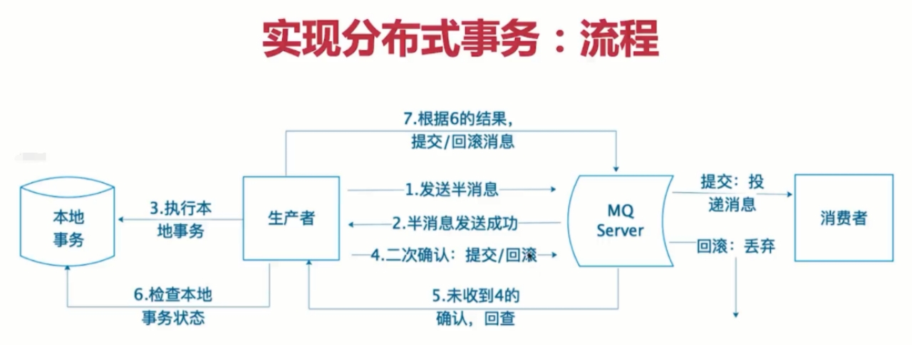
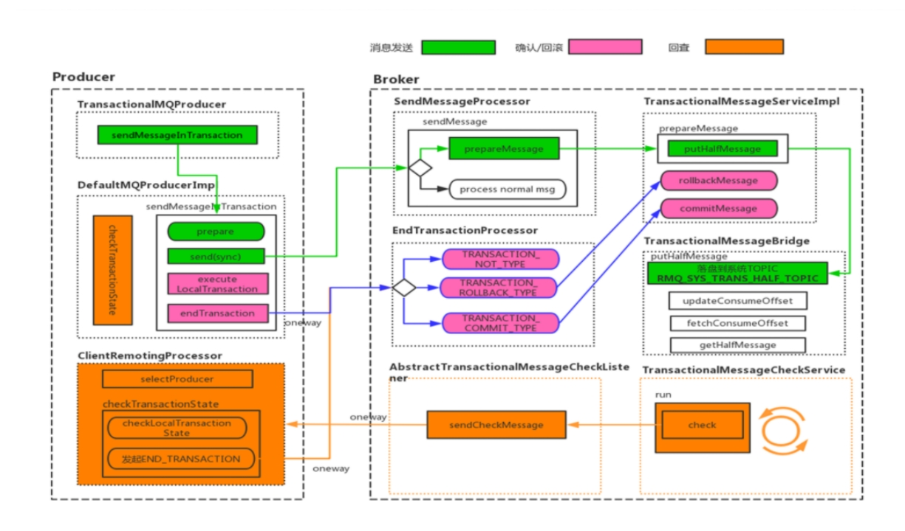

## ***1、为什么使用消息队列？*** 

其实就是问问你消息队列都有哪些使用场景，然后你项目里具体是什么场景，说说你在这个场景里用消息队列是什么？

面试官问你这个问题，期望的一个回答是说，你们公司有个什么业务场景，这个业务场景有个什么技术挑战，如果不用MQ可能会很麻烦，但是你现在用了MQ之后带给了你很多的好处。消息队列的常见使用场景，其实场景有很多，但是比较核心的有3个：解耦、异步、削峰。

**解耦：**

A系统发送个数据到BCD三个系统，接口调用发送，那如果E系统也要这个数据呢？那如果C系统现在不需要了呢？现在A系统又要发送第二种数据了呢？而且A系统要时时刻刻考虑BCDE四个系统如果挂了咋办？要不要重发？我要不要把消息存起来？

你需要去考虑一下你负责的系统中是否有类似的场景，就是一个系统或者一个模块，调用了多个系统或者模块，互相之间的调用很复杂，维护起来很麻烦。但是其实这个调用是不需要直接同步调用接口的，如果用MQ给他异步化解耦，也是可以的，你就需要去考虑在你的项目里，是不是可以运用这个MQ去进行系统的解耦。

**异步：**

A系统接收一个请求，需要在自己本地写库，还需要在BCD三个系统写库，自己本地写库要30ms，BCD三个系统分别写库要300ms、450ms、200ms。最终请求总延时是30 + 300 + 450 + 200 = 980ms，接近1s，异步后，BCD三个系统分别写库的时间，A系统就不再考虑了。

**削峰：**

每天0点到16点，A系统风平浪静，每秒并发请求数量就100个。结果每次一到16点~23点，每秒并发请求数量突然会暴增到1万条。但是系统最大的处理能力就只能是每秒钟处理1000个请求啊。怎么办？需要我们进行流量的削峰，让系统可以平缓的处理突增的请求。

 

## **2、消息队列有什么优点和缺点?**

优点上面已经说了，就是在特殊场景下有其对应的好处，解耦、异步、削峰。

缺点呢？

**系统可用性降低**

系统引入的外部依赖越多，越容易挂掉，本来你就是A系统调用BCD三个系统的接口就好了，ABCD四个系统好好的，没啥问题，你偏加个MQ进来，万一MQ挂了怎么办？MQ挂了，整套系统崩溃了，业务也就停顿了。

**系统复杂性提高**

硬生生加个MQ进来，怎么保证消息没有重复消费？怎么处理消息丢失的情况？怎么保证消息传递的顺序性？

**一致性问题**

A系统处理完了直接返回成功了，人都以为你这个请求就成功了；但是问题是，要是BCD三个系统那里，BD两个系统写库成功了，结果C系统写库失败了，你这数据就不一致了。

所以消息队列实际是一种非常复杂的架构，你引入它有很多好处，但是也得针对它带来的坏处做各种额外的技术方案和架构来规避掉。

## ***3、常见消息队列的比较*** 

 

## ***4、Kafka的特性***

1、消息持久化

2、高吞吐量

3、扩展性

4、多客户端支持

5、Kafka Streams

## ***5、RabbitMQ中的vhost起什么作用？***

虚拟消息服务器，vhost，本质上就是一个mini版的mq服务器，有自己的队列、交换器和绑定，最重要的，自己的权限机制。Vhost提供了逻辑上的分离，可以将众多客户端进行区分，又可以避免队列和交换器的命名冲突。Vhost必须在连接时指定，rabbitmq包含缺省vhost：“/”，通过缺省用户和口令guest进行访问。

rabbitmq里创建用户，必须要被指派给至少一个vhost，并且只能访问被指派内的队列、交换器和绑定。Vhost必须通过rabbitmq的管理控制工具创建。

 

## ***6、RabbitMQ上的一个queue中存放的message是否有数量限制？限制是多少***

默认情况下一般是无限制，因为限制取决于机器的内存，但是消息过多会导致处理效率的下降。

可以通过参数来限制， x-max-length ：对队列中消息的条数进行限制  ， x-max-length-bytes ：对队列中消息的总量进行限制

## ***7、说一说Kafka你熟悉的参数？***

必选属性

创建生产者对象时有三个属性必须指定。

bootstrap.servers

该属性指定broker的地址清单，地址的格式为host:port。清单里不需要包含所有的broker地址，生产者会从给定的broker里查询其他broker的信息。不过最少提供2个broker的信息(用逗号分隔，比如: 127.0.0.1:9092,192.168.0.13:9092)，一旦其中一个宕机，生产者仍能连接到集群上。

key.serializer

生产者接口允许使用参数化类型，可以把Java对象作为键和值传broker，但是broker希望收到的消息的键和值都是字节数组，所以，必须提供将对象序列化成字节数组的序列化器。key.serializer必须设置为实现org.apache.kafka.common.serialization.Serializer的接口类，Kafka的客户端默认提供了ByteArraySerializer,IntegerSerializer, StringSerializer，也可以实现自定义的序列化器。

value.serializer

同 key.serializer。

**acks：**

Kafk内部的复制机制是比较复杂的，这里不谈论内部机制（后续章节进行细讲），我们只讨论生产者发送消息时与副本的关系。

指定了必须要有多少个分区副本收到消息，生产者才会认为写入消息是成功的，这个参数对消息丢失的可能性有重大影响。

acks=0：生产者在写入消息之前不会等待任 何来自服务器的响应，容易丢消息，但是吞吐量高。

acks=1：只要集群的首领节点收到消息，生产者会收到来自服务器的成功响应。如果消息无法到达首领节点（比如首领节点崩溃，新首领没有选举出来），生产者会收到一个错误响应，为了避免数据丢失，生产者会重发消息。不过，如果一个没有收到消息的节点成为新首领，消息还是会丢失。默认使用这个配置。

acks=all：只有当所有参与复制的节点都收到消息，生产者才会收到一个来自服务器的成功响应。延迟高。

金融业务，主备外加异地灾备。所以很多高可用场景一般不是设置2个副本，有可能达到5个副本，不同机架上部署不同的副本，异地上也部署一套副本。

buffer.memory

设置生产者内存缓冲区的大小（结合[生产者发送消息的基本流程](#_生产者发送消息的基本流程)），生产者用它缓冲要发送到服务器的消息。如果数据产生速度大于向broker发送的速度，导致生产者空间不足，producer会阻塞或者抛出异常。缺省33554432 (32M)

max.block.ms

指定了在调用send()方法或者使用partitionsFor()方法获取元数据时生产者的阻塞时间。当生产者的发送缓冲区已满，或者没有可用的元数据时，这些方法就会阻塞。在阻塞时间达到max.block.ms时，生产者会抛出超时异常。缺省60000ms

retries

发送失败时，指定生产者可以重发消息的次数（缺省Integer.MAX_VALUE）。默认情况下，生产者在每次重试之间等待100ms，可以通过参数retry.backoff.ms参数来改变这个时间间隔。

receive.buffer.bytes和send.buffer.bytes

指定TCP socket接受和发送数据包的缓存区大小。如果它们被设置为-1，则使用操作系统的默认值。如果生产者或消费者处在不同的数据中心，那么可以适当增大这些值，因为跨数据中心的网络一般都有比较高的延迟和比较低的带宽。缺省102400

batch.size

当多个消息被发送同一个分区时，生产者会把它们放在同一个批次里。该参数指定了一个批次可以使用的内存大小，按照字节数计算。当批次内存被填满后，批次里的所有消息会被发送出去。但是生产者不一定都会等到批次被填满才发送，半满甚至只包含一个消息的批次也有可能被发送。缺省16384(16k) ，如果一条消息超过了批次的大小，会写不进去。

linger.ms

指定了生产者在发送批次前等待更多消息加入批次的时间。它和batch.size以先到者为先。也就是说，一旦我们获得消息的数量够batch.size的数量了，他将会立即发送而不顾这项设置，然而如果我们获得消息字节数比batch.size设置要小的多，我们需要“linger”特定的时间以获取更多的消息。这个设置默认为0，即没有延迟。设定linger.ms=5，例如，将会减少请求数目，但是同时会增加5ms的延迟，但也会提升消息的吞吐量。

compression.type

producer用于压缩数据的压缩类型。默认是无压缩。正确的选项值是none、gzip、snappy。压缩最好用于批量处理，批量处理消息越多，压缩性能越好。snappy占用cpu少，提供较好的性能和可观的压缩比，如果比较关注性能和网络带宽，用这个。如果带宽紧张，用gzip，会占用较多的cpu，但提供更高的压缩比。

client.id	

当向server发出请求时，这个字符串会发送给server。目的是能够追踪请求源头，以此来允许ip/port许可列表之外的一些应用可以发送信息。这项应用可以设置任意字符串，因为没有任何功能性的目的，除了记录和跟踪。

max.in.flight.requests.per.connection	

指定了生产者在接收到服务器响应之前可以发送多个消息，值越高，占用的内存越大，当然也可以提升吞吐量。发生错误时，可能会造成数据的发送顺序改变,默认是5 (修改）。

如果需要保证消息在一个分区上的严格顺序，这个值应该设为1。不过这样会严重影响生产者的吞吐量。

request.timeout.ms

客户端将等待请求的响应的最大时间,如果在这个时间内没有收到响应，客户端将重发请求;超过重试次数将抛异常，默认30秒。

metadata.fetch.timeout.ms

是指我们所获取的一些元数据的第一个时间数据。元数据包含：topic，host，partitions。此项配置是指当等待元数据fetch成功完成所需要的时间，否则会跑出异常给客户端

max.request.size

控制生产者发送请求最大大小。默认这个值为1M，如果一个请求里只有一个消息，那这个消息不能大于1M，如果一次请求是一个批次，该批次包含了1000条消息，那么每个消息不能大于1KB。注意：broker具有自己对消息记录尺寸的覆盖，如果这个尺寸小于生产者的这个设置，会导致消息被拒绝。这个参数和Kafka主机的[message.max.bytes](#_message.max.bytes) 参数有关系。如果生产者发送的消息超过message.max.bytes设置的大小，就会被Kafka服务器拒绝。

以上参数不用去，一般来说，就记住acks、batch.size、linger.ms、max.request.size就行了，因为这4个参数重要些，其他参数一般没有太大必要调整。

## ***8、kafka中，可以不用zookeeper么？***

新版本的kafka可以不用，3.0以上可以使用Kafka with Kraft，就可以完全抛弃zookeeper

## ***9、 说一说RabbitMQ中的AMQP***

RabbitMQ就是 AMQP 协议的 Erlang 的实现(当然 RabbitMQ 还支持 STOMP2、 MQTT3 等协议 ) AMQP 的模型架构 和 RabbitMQ 的模型架构是一样的，生产者将消息发送给交换器，交换器和队列绑定 。RabbitMQ 中的交换器、交换器类型、队列、绑定、路由键等都是遵循的 AMQP 协议中相 应的概念。

## ***10、RabbitMQ开启持久化机制，有什么要注意的点？***

1、效率变低

2、开启持久化需要交换器、队列、消息三者都需要持久化

## ***11、kafka适合哪些场景？***

## ***12、RabbitMQ中交换器4种类型？***

主要有以下4种。

fanout: 把所有发送到该交换器的消息路由到所有与该交换器绑定的队列中。

direct:把消息路由到BindingKey和RoutingKey完全匹配的队列中。

topic: 匹配规则： RoutingKey 为一个 点号'.': 分隔的字符串。比如: java.xiaoka.show BindingKey和RoutingKey一样也是点号“.“分隔的字符串。 BindingKey可使用 * 和 # 用于做模糊匹配，*匹配一个单词，#匹配多个或者0个

headers:不依赖路由键匹配规则路由消息。是根据发送消息内容中的headers属性进行匹配。性能差，基本用不到。

## ***13、为什么Kafka不支持读写分离？***

***1、数据一致性问题：***数据从主节点转到从节点，必然会有一个延时的时间窗口，这个时间窗口会导致主从节点之间的数据不一致。

***2、延时问题：Kafka追求高性能，如果走主从复制，延时严重***

## ***14、Kafka中是怎么做到消息顺序性的？***

一个 topic，一个 partition，一个 consumer，内部单线程消费。

生产者在发送消息的时候指定要发送到特定Partition(分区)

将 producer 发送的数据封装成一个 ProducerRecord 对象。

（1）指明 partition 的情况下，直接将指明的值直接作为 partiton 值；

（2）没有指明 partition 值但有 key 的情况下，在Producer往Kafka插入数据时，控制同一Key分发到同一Partition，并且设置参数max.in.flight.requests.per.connection=1，也即同一个链接只能发送一条消息，如此便可严格保证Kafka消息的顺序

## ***15、Kafka为什么那么快？***

***1. 利用 Partition 实现并行处理***

***2. 顺序写磁盘***

***3. 充分利用 Page Cache***

***4. 零拷贝技术***

***5. 批处理***

***6. 数据压缩***

## ***16、如何解决重复消费？***

消息被重复消费，就是消费方多次接受到了同一条消息。根本原因就是，第一次消费完之后，消费方给 MQ 确认已消费的反馈，MQ 没有成功接受。比如网络原因、MQ 重启等。所以 MQ 是无法保证消息不被重复消费的，只能业务系统层面考虑。不被重复消费的问题，就被转化为消息消费的幂等性的问题。幂等性就是指一次和多次请求的结果一致，多次请求不会产生副作用。保证消息消费的幂等性可以考虑下面的方式：给消息生成全局 id，消费成功过的消息可以直接丢弃消息中保存业务数据的主键字段，结合业务系统需求场景进行处理，避免多次插入、是否可以根据主键多次更新而并不影响结果等

## ***17、Rocketmq如何保证高可用性？***

1、架构层面

避免用单节点或者简单的一主一从架构，可以采取多主从的架构，并且主从之间采用同步复制的方式进行数据双写。

2、刷盘策略

RocketMQ默认的异步刷盘，可以改成同步刷盘SYNC_FLUSH。

3、生产消息的高可用

当消息发送失败了，在消息重试的时候，会尽量规避上一次发送的 Broker，选择还没推送过该消息的Broker，以增大消息发送的成功率。

4、消费消息的高可用

消费者获取到消息之后，可以等到整个业务处理完成，再进行CONSUME_SUCCESS状态确认，如果业务处理过程中发生了异常那么就会触发broker的重试机制。

## ***18、RocketMq的存储机制了解吗？***

消息生产者发送消息到broker，都是会按照顺序存储在CommitLog文件中，每个commitLog文件的大小为1G

 

CommitLog-存储所有的消息元数据，包括Topic、QueueId以及message

CosumerQueue-消费逻辑队列：存储消息在CommitLog的offset

IndexFile-索引文件：存储消息的key和时间戳等信息，使得RocketMq可以采用key和时间区间来查询消息 

也就是说，rocketMq将消息均存储在CommitLog中，并分别提供了CosumerQueue和IndexFile两个索引，来快速检索消息

## ***19、RocketMq性能比较高的原因？***

1.顺序写

  顺序写比随机写的性能会高很多，不会有大量寻址的过程

2.异步刷盘

  相比较于同步刷盘，异步刷盘的性能会高很多

3.零拷贝

  使用mmap的方式进行零拷贝，提高了数据传输的效率

## ***20、让你来设计一个消息队列，你会怎么设计？***

数据存储角度：

理论上，从速度来看，分布式文件系统>分布式KV（持久化）>数据库，而可靠性却截然相反，如果追求性能可以基于文件系统的顺序写。

高可用角度：

分区+复制+选举的思想

网络框架角度：

选用高效的Netty框架，producer 同步异步发送消息，consumer 同步异步接收消息。同步能够保证结果，异步能够保证性能。

## ***21、有几百万消息持续积压几小时，说说怎么解决？***

发生了线上故障，几千万条数据在MQ里积压很久。是修复consumer的问题，让他恢复消费速度，然后等待几个小时消费完毕？这是个解决方案。不过有时候我们还会进行临时紧急扩容。

一个消费者一秒是1000条，一秒3个消费者是3000条，一分钟是18万条。1000多万条，所以如果积压了几百万到上千万的数据，即使消费者恢复了，也需要大概1小时的时间才能恢复过来。

一般这个时候，只能操作临时紧急扩容了，具体操作步骤和思路如下：

先修复consumer的问题，确保其恢复消费速度，然后将现有consumer都停掉。

新建一个topic，partition是原来的10倍，临时建立好原先10倍或者20倍的queue数量。然后写一个临时的分发数据的consumer程序，这个程序部署上去消费积压的数据，消费之后不做耗时的处理，直接均匀轮询写入临时建立好的10倍数量的queue。

接着临时征用10倍的机器来部署consumer，每一批consumer消费一个临时queue的数据。

这种做法相当于是临时将queue资源和consumer资源扩大10倍，以正常的10倍速度来消费数据。

等快速消费完积压数据之后，再恢复原先部署架构，重新用原先的consumer机器来消费消息。

## ***22、Rocketmq中Broker的部署方式***

1.单台 Master 部署;

2.多台 Master部署

3.多台主从部署

## ***23、Rocketmq中Broker的刷盘策略有哪些？***

**同步刷盘**

SYNC_FLUSH（同步刷盘）：生产者发送的每一条消息都在保存到磁盘成功后才返回告诉生产者成功。这种方式不会存在消息丢失的问
题，但是有很大的磁盘IO开销，性能有一定影响。

**异步刷盘**

ASYNC_FLUSH（异步刷盘）：生产者发送的每一条消息并不是立即保存到磁盘，而是暂时缓存起来，然后就返回生产者成功。随后再异步的将缓存数据保存到磁盘，有两种情况：1是定期将缓存中更新的数据进行刷盘，2是当缓存中更新的数据条数达到某一设定值后进行刷盘。这种异步的方式会存在消息丢失（在还未来得及同步到磁盘的时候宕机），但是性能很好。默认是这种模式。

## ***24、什么是路由注册？RocketMQ如何进行路由注册？***

RocketMQ的路由注册是通过broker向NameServer发送心跳包实现的，首先borker每隔30s向nameserver发送心跳语句，nameserver处理

## ***25、什么是路由发现？RocketMQ如何进行路由发现？***

RocketMQ的路由发现不是实时的，NameServer不会主动向客户端推送，而是客户端定时拉取主题最新的路由，然后更新。 

step1：调用RouterInfoManager的方法，从路由表topicQueueTable、brokerAddrTable、filterServerTable分别填充信息； 

step2：如果主题对应的消息为顺序消息，则从NameServerKVconfig中获取关于顺序消息相关的配置填充路由信息；

## ***26、什么是路由剔除？RocketMQ如何进行路由剔除？***

路由删除有两个触发节点：

1）NameServer定时扫描brokerLiveTable检测上次心跳包与当前系统时间的时间差，如果大于120S，就需要删除；

2）Broker在正常关闭使，会执行unregisterBroker命令。

两种方法删除的逻辑都是一致的 

step1：申请写锁

step2：从brokerLiveTable、filterServerTable移除，从brokerAddrTable、clusterAddrTable、topicQueueTable移除

step3：释放锁

## ***27、使用RocketMQ过程中遇到过什么问题？***

1、消息挤压问题

2、消息丢失问题

3、消息重复消费问题

 4、RocketMQ内存不够OOM问题

## ***28、RocketMQ的总体架构，以及每个组件的功能？***

RocketMQ 一共由四个部分组成：NameServer、Broker、Producer、Consumer，它们分别对应着发现、存、发、收四个功能。这四部分的功能很像邮政系统，Producer 相当于负责发送信件的发件人，Consumer 相当于负责接收信件的收件人，Broker 相当于负责暂存信件传输的邮局，NameServer 相当于负责协调各个地方邮局的管理机构。一般情况下，为了保证高可用，每一部分都是以集群形式部署的。

## ***29、讲一讲RocketMQ中的分布式事务及实现***

 

## ***30、讲一讲RocketMQ中事务回查机制的实现***

 